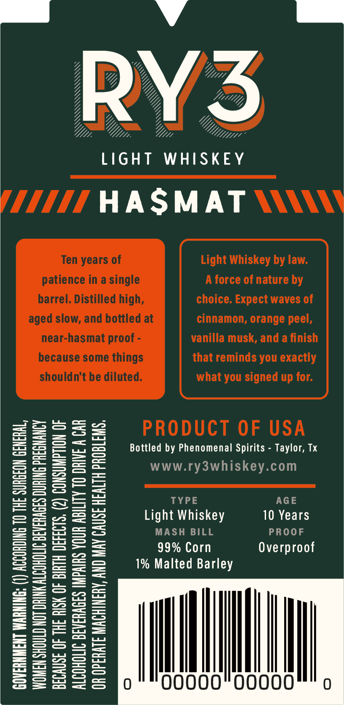
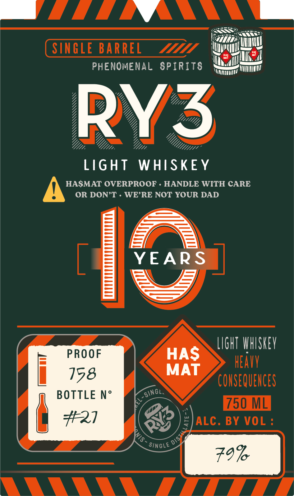

# TTB COLA Label Images - TTBID 26195001000909

**Brand Name:** RY3

**Issue Date:** 07/17/2026

**Origin Code:** 44

**Product Class/Type:** 144

**Source:** [TTB Public COLA Registry](https://ttbonline.gov/colasonline/viewColaDetails.do?action=publicFormDisplay&ttbid=26195001000909)

## Label Images

### Back Label

### Label 1

## Extracted Label Text

*Text extracted via OCR - may contain errors*

**Detected Proof:** 158
**Detected Age:** 10 Years

### Back Label

RY3
LIGHT
WHISKEY
HASMAT
Ten years of
Light Whiskey by Iaw:
patience in a single
A force of nature by
barrel. Distilled high,
choice. Expect waves of
aged slow, and bottled at
cinnamon, orange peel,
near-hasmat proof = _
vanilla musk, and a finish
because some things
that reminds you exactly
shouldn't be diluted.
what you signed up for:
5
3
PRODUCT OF USA
8
E
1
Bottled by Phenomenal Spirits
Taylor, Tx
1
Ii
3
2
WWW.ry3whiskey.com
H
2
58
TYPE
AGE
F
3
Light Whiskey
10 Years
1
I
E22
99% Corn
Overproof
123
1% Malted Barley
=
5
1
1
1
1
1
8
5
13
5
00

### Label 1

SINGLE BARREL
M
PHENOMENAL SPIRITS
RY3
LIGHT
WHISKE Y
HASMAT OVERPROOF
HANDLE WITH CARE
OR DON'T
WE'RE NOT YOUR DAD
YEARS
LIGHT VHISKEV
PROOF
HAS
HEAVV
158
MAT
COUSEQUEHCES
BOTTLE No
750 ML
427
ALC . BY VOL :
SinGLE
79%
Singl;
4
3
DIST
