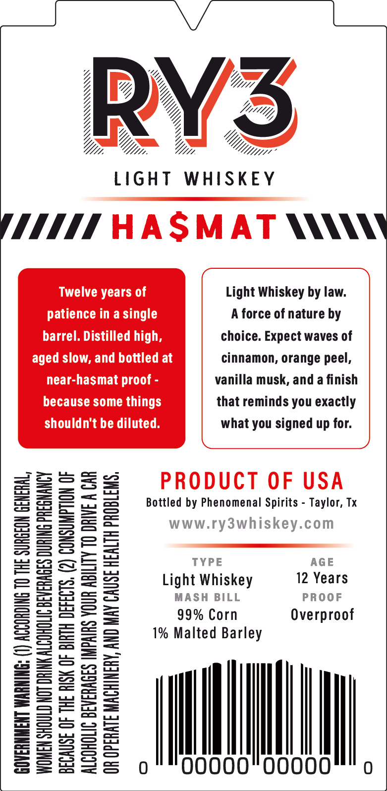
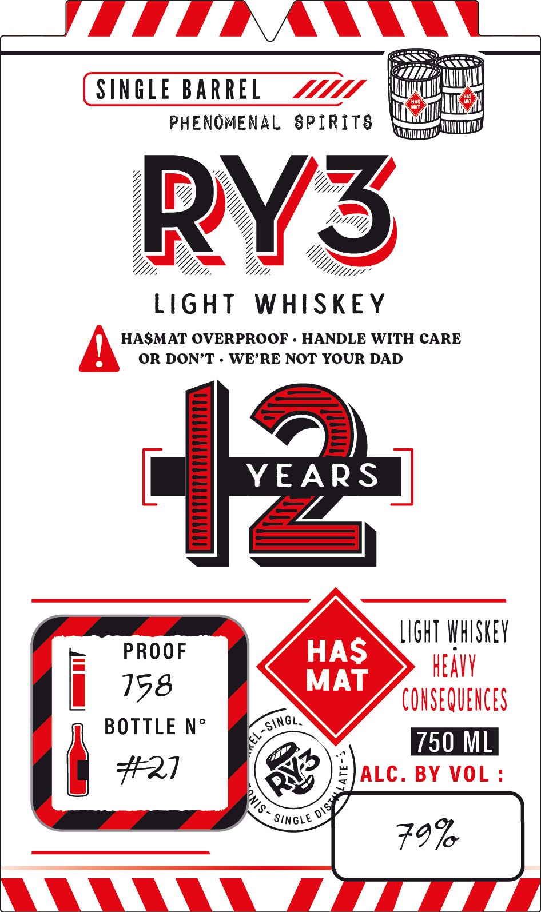

# TTB COLA Label Images - TTBID 26195001000910

**Brand Name:** RY3

**Issue Date:** 07/17/2026

**Origin Code:** 44

**Product Class/Type:** 144

**Source:** [TTB Public COLA Registry](https://ttbonline.gov/colasonline/viewColaDetails.do?action=publicFormDisplay&ttbid=26195001000910)

## Label Images

### Back Label

### Label 1

## Extracted Label Text

*Text extracted via OCR - may contain errors*

**Detected Proof:** 99
**Detected Age:** 12 Years

### Back Label

MXTTS Vs q“9“°w“ssw

LN

_~.

Ui. Wi.

LIGHT

Twelve years of
patience in a single
barrel. Distilled high,

aged slow, and bottled at
near-hasmat proof -
because some things
shouldn't be diluted.

Pp

Li

1%

(I) ACCORDING TO THE SURGEON GENERAL,

WOMEN SHOULD NOT DRINK ALCOHOLIC BEVERAGES DURING PREGNANCY

BECAUSE OF THE RISK OF BIRTH DEFECTS. (2) CONSUMPTION OF

ALCOHOLIC BEVERAGES IMPAIRS YOUR ABILITY TO DRIVE A CAR
OR OPERATE MACHINERY, AND MAY CAUSE HEALTH PROBLEMS,

GOVERNMENT WARNING:

0

W111,
Dy
7 5<
WHISKEY

(MMT AASMAT NNN

Bottled by Phenomenal Spirits - Taylor, Tx

Ww

Light Whiskey by law.
A force of nature by
choice. Expect waves of
cinnamon, orange peel,
vanilla musk, and a finish
that reminds you exactly
what you signed up for.

fe

RODUCT OF USA

w.r

TYPE AGE
ght Whiskey 12 Years
MASH BILL PROOF
99% Corn Overproof
Malted Barley

00000 Il 0

### Label 1

SINGLE BARREL
PHENOMENAL 8PIRITS
RY3
[ight
WHISkEY
HASMAT OVERPROOF
HANDLE WITH CARE
OR DON'T
WE'RE NOT YOUR DAD
YEARS
LIGHT WHFSKEV
PROOF
HAS
HEAY
158
MAT
CONSEQUENCES
BOTTLE No
750 ML
47
21
#
ALC . BY
VOL :
SingLe
79%
singl,
0
DIST
