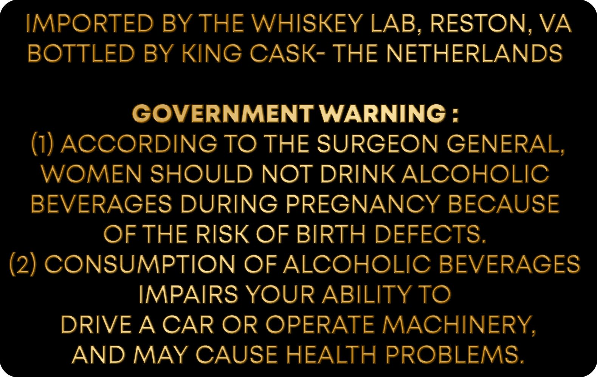
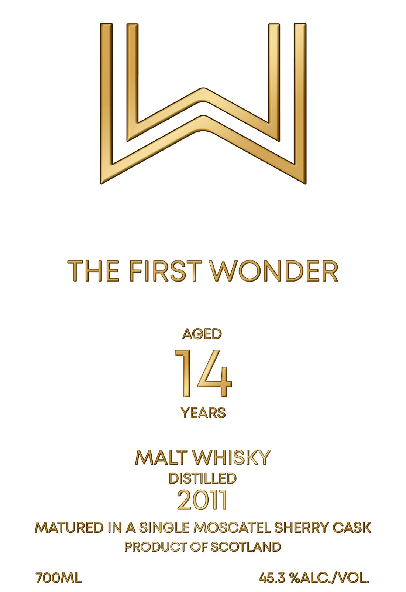

# TTB COLA Label Images - TTBID 26196001000110

**Brand Name:** THE FIRST WONDER

**Fanciful Name:** AGED 14 YEARS

**Issue Date:** 07/30/2026

**Origin Code:** 5K

**Product Class/Type:** 118

**Source:** [TTB Public COLA Registry](https://ttbonline.gov/colasonline/viewColaDetails.do?action=publicFormDisplay&ttbid=26196001000110)

## Label Images

### Back Label

### Front Label

## Extracted Label Text

*Text extracted via OCR - may contain errors*

**Detected Proof:** 90.6
**Detected Age:** 14 Years

### Back Label

IMPORTED BY THE WHISKEY LAB, RESTON, VA

BOTTLED BY KING CASK- THE NETHERLANDS

GOVERNMENT WARNING :

(1) ACCORDING TO THE SURGEON GENERAL,

WOMEN SHOULD NOT DRINK ALCOHOLIC

BEVERAGES DURING PREGNANCY BECAUSE

OF THE RISK OF BIRTH DEFECTS.

(2) CONSUMPTION OF ALCOHOLIC BEVERAGES

IMPAIRS YOUR ABILITY TO

DRIVE A CAR OR OPERATE MACHINERY,

AND MAY CAUSE HEALTH PROBLEMS.

### Front Label

THE FIRST WONDER
AGED
14
YEARS
MALT WHISKY
DISTILLED
2011
MATURED IN A SINGLE MOSCATEL SHERRY CASK
PRODUCT OF SCOTLAND
ZOOML
45.3 %ALCIVOL:
