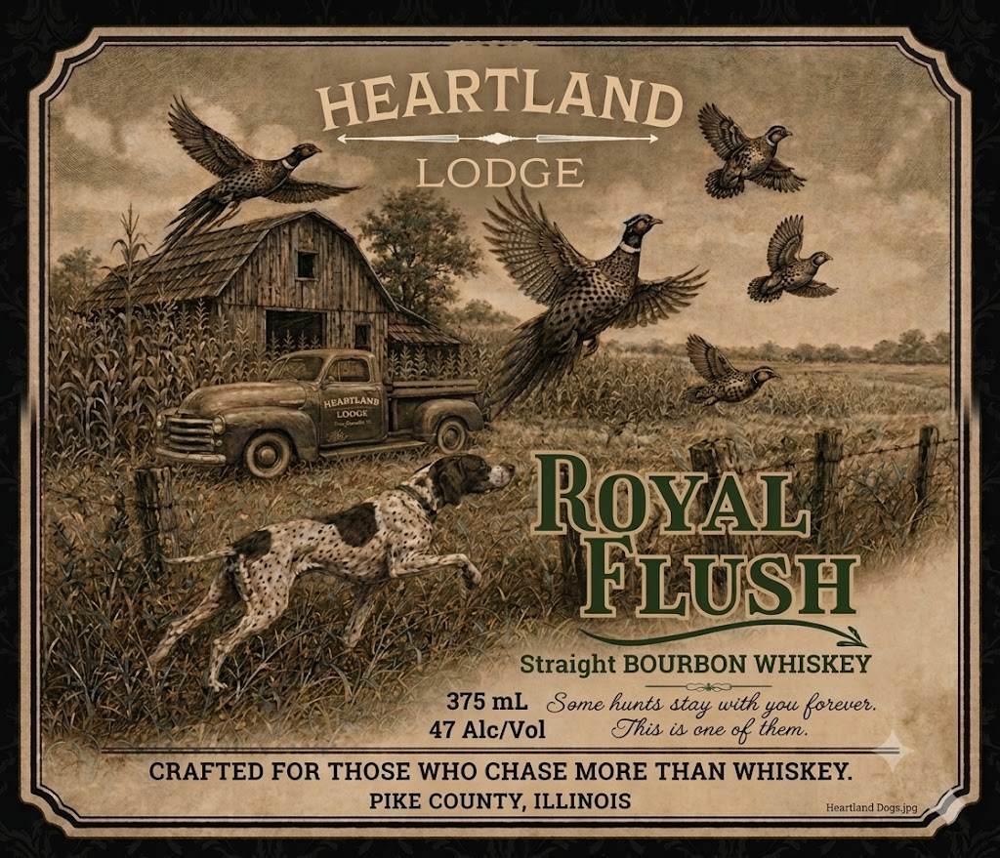
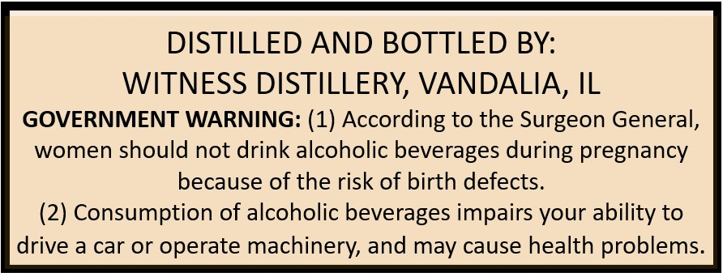

# TTB COLA Label Images - TTBID 26196001000177

**Brand Name:** ROYAL FLUSH

**Issue Date:** 07/17/2026

**Origin Code:** 04

**Product Class/Type:** 101

**Source:** [TTB Public COLA Registry](https://ttbonline.gov/colasonline/viewColaDetails.do?action=publicFormDisplay&ttbid=26196001000177)

## Label Images

### Label 1

### Label 2

## Extracted Label Text

*Text extracted via OCR - may contain errors*

### Label 1

= ~ ms ge ea eS ee ae
: ye A : Sop ti
3 gb i Aig ey Se ee
NA ELT CU, News ad Bo) RE eZ 53
Watee mel (Mall, Se . Li = ed
Meena INI eam 7° gual
YEAR RT| OM Re! =
Lavinia Fiisin Wes Nee? (ee, \ See ideemueagme
NAN ayaa Be cons TO MUG LR | ee es
Keio ce ae a me a aE
NAY Cole 07 gen es) a 2) REIS PR RR. iat |
neuen’ (0) rar Sh ee ee ee
RAEN cere en Detail aay \ ty ean. ee
= Sau Eats, aie site ‘ ) cf fe) a
ly ae ie Qe UC ip. Oya
[ed Vise Mette G |) Ps ra) ae
PS) Nae See aoe en I” | Bl (LS) & fe
NUN CSS REN ANY SIL,
ara a as EWE a ae
KSA X A ON ea i =
BNW Ae oe ae Straight BOURBON WHISKEY
WAS AeRN. WARN BEG a
SAP Cage eee STSML Some hunts stay with you forever.
RaNeeeee pre so” ana i 47 Alc/Vol This it one of them.
~ CRAFTED FOR THOSE WHO CHASE MORE THAN WHISKEY.
PIKE COUNTY, ILLINOIS Heariand Doteive

### Label 2

DISTILLED AND BOTTLED BY:

WITNESS DISTILLERY, VANDALIA, IL

GOVERNMENT WARNING: (1) According to the Surgeon General,

women should not drink alcoholic beverages during pregnancy

because of the risk of birth defects.

(2) Consumption of alcoholic beverages impairs your ability to

drive a car or operate machinery, and may cause health problems
