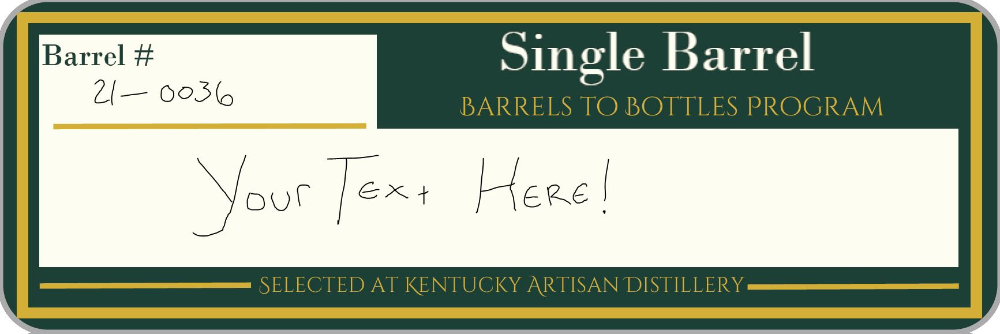
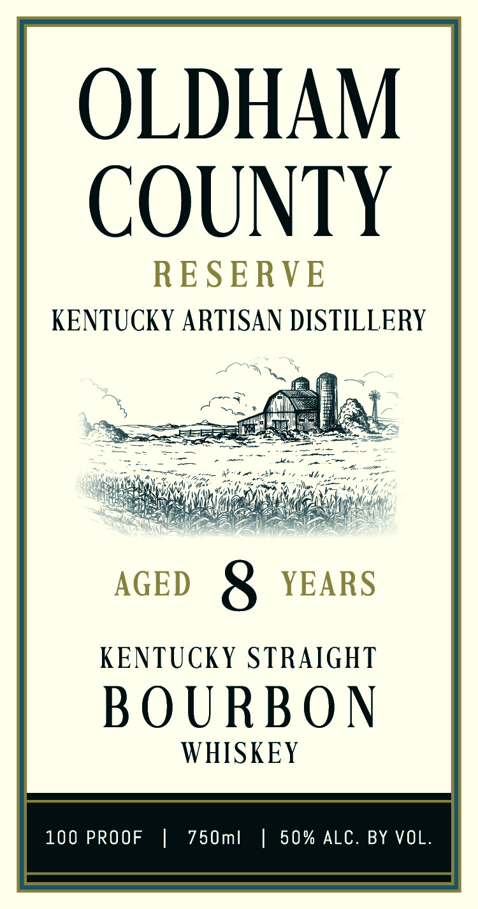

# TTB COLA Label Images - TTBID 26196001000215

**Brand Name:** KENTUCKY ARTISAN DISTILLERY

**Fanciful Name:** OLDHAM COUNTY RESERVE

**Issue Date:** 07/17/2026

**Origin Code:** 22

**Product Class/Type:** 101

**Source:** [TTB Public COLA Registry](https://ttbonline.gov/colasonline/viewColaDetails.do?action=publicFormDisplay&ttbid=26196001000215)

## Label Images

### Back Label

### Front Label

### Label 3

## Extracted Label Text

*Text extracted via OCR - may contain errors*

*1 image(s) excluded: text did not meet readability threshold*

**Detected Proof:** 100
**Detected Age:** 8 Years

### Back Label

Barrel #
Single Barrel
2 _ 0o36
BARRELS TO BOTTLES PROGRAM
Text
Kere
SELECTED AT KENTUCKY ARTISAN DISTILLERY
ooC

### Front Label

OLDHAM

COUNTY

RESERVE

KENTUCKY ARTISAN DISTILLERY

_s

geek

ans

AGED 8 YEARS

KENTUCKY STRAIGHT

BOURBON

WHISKEY

100 PROOF | 750ml | 50% ALC. BY VOL
