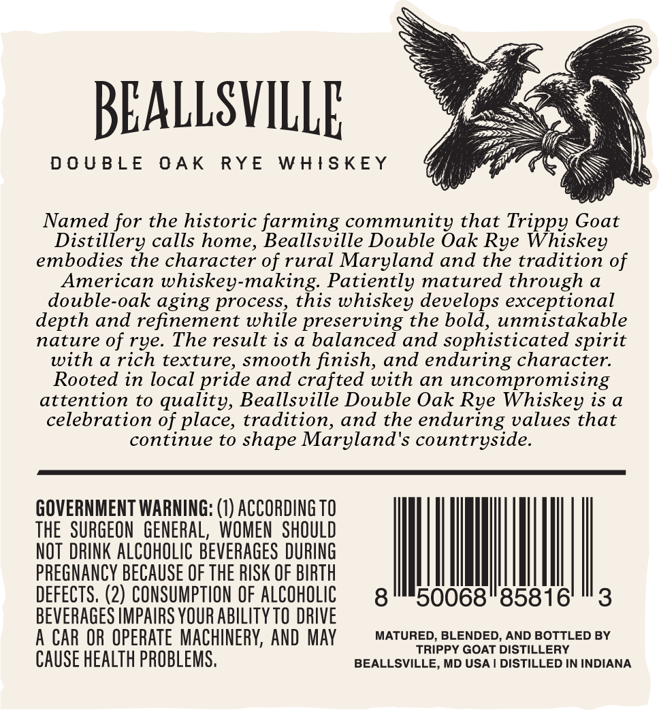
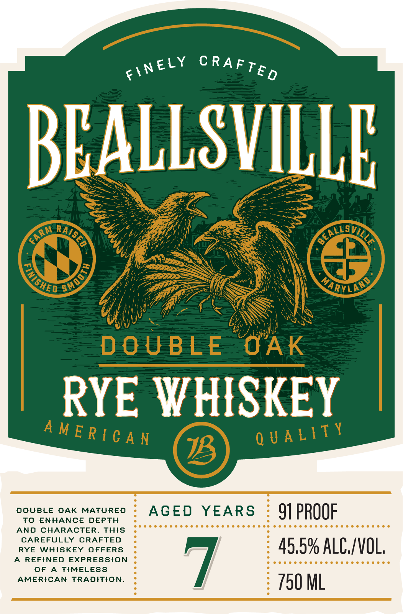

# TTB COLA Label Images - TTBID 26196001000246

**Brand Name:** BEALLSVILLE RYE

**Issue Date:** 07/21/2026

**Origin Code:** 25

**Product Class/Type:** 142

**Source:** [TTB Public COLA Registry](https://ttbonline.gov/colasonline/viewColaDetails.do?action=publicFormDisplay&ttbid=26196001000246)

## Label Images

### Back Label

### Front Label

## Extracted Label Text

*Text extracted via OCR - may contain errors*

**Detected Proof:** 91

### Back Label

BEALLSVILLE

DOUBLE OAK RYE WHISKEY

Named for the historic farming community that Trippy Goat
Distillery calls home, Beallsville Double Oak Rye Whiskey
embodies the character of rural Maryland and the tradition of
American whiskey-making. Patiently matured through a
double-oak aging process, this whiskey develops exceptional
depth and refinement while preserving the bold, unmistakable
nature of rye. The result is a balanced and sophisticated spirit
with a rich texture, smooth finish, and enduring character.
Rooted in local pride and crafted with an uncompromising
attention to quality, Beallsville Double Oak Rye Whiskey is a
celebration of place, tradition, and the enduring values that
continue to shape Maryland's countryside.

GOVERNMENT WARNING: (1) ACCORDING TO
THE SURGEON GENERAL, WOMEN SHOULD
NOT DRINK ALCOHOLIC BEVERAGES DURING
8" 50068"85816' "3

PREGNANCY BECAUSE OF THE RISK OF BIRTH
DEFECTS. (2) CONSUMPTION OF ALCOHOLIC
BEVERAGES IMPAIRS YOUR ABILITY T0 DRIVE
A CAR OR OPERATE MACHINERY, AND MAY = MATURED, BLENDED, AND BOTTLED BY

RIPPY GOAT DISTILLE!

CAUSE HEALTH PROBLEMS. BEALLSVILLE, MD USA | DISTILLED IN INDIANA

### Front Label

BEALLSVILLE
Vi
NaryLAS
DO U BL E
OAk
RYE WHISKEY
A
DOUBLE
OAK
MATURED
AGED
YEARS
91 PROOF
To
ENHANCE
DEPTH
AND
CHARACTER
Thts
CAREFULLY
CRAFTED
RYE
W##SKEY
OFFERS
45,5% ALC/VOL,
REFINED
EXPRESSION
OF
TIMELESS
7
AMERICAN
TRADITION.
750 ML
C RAFTE D
FINELY
BEALLS E
QAISED
FARM
SMmodTY
'ISHED
Q U A LTTY
M E R [ € A N
