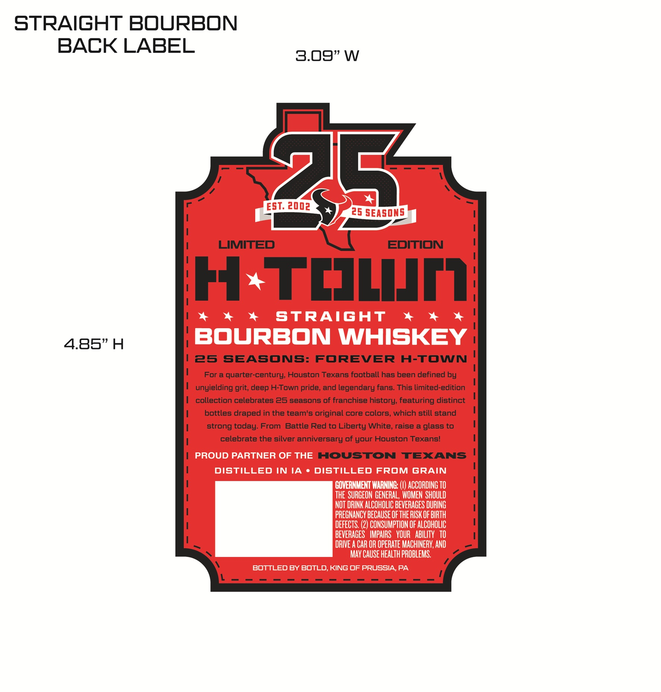
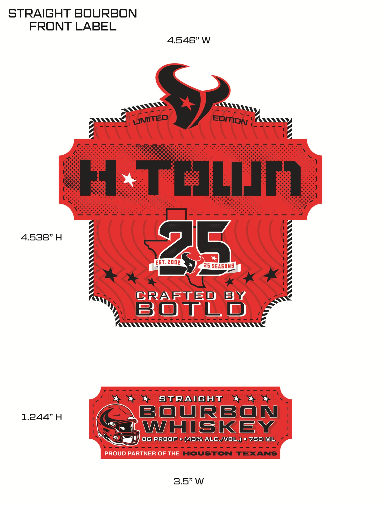

# TTB COLA Label Images - TTBID 26196001000273

**Brand Name:** H TOWN

**Issue Date:** 07/17/2026

**Origin Code:** 39

**Product Class/Type:** 101

**Source:** [TTB Public COLA Registry](https://ttbonline.gov/colasonline/viewColaDetails.do?action=publicFormDisplay&ttbid=26196001000273)

## Label Images

### Back Label

### Label 1

## Extracted Label Text

*Text extracted via OCR - may contain errors*

**Detected Proof:** 85

### Back Label

STRAIGHT BOURBON
BACK LABEL
3.09"W
ESL
25
2002
25 SEASONS
LIMITED
EDITION
H
TcILIM
StRAGHT
4.85"H
BOURBON WHISKEY
25
SEAsOnS:
FOREVER
H-TOWN
Fora quarter-century; Houston Texans football has been defined by
unyielding
deep H-Town pride, and legendary fans. This limited-edition
collection celebrates 26 seasons of franchise history; featuring distinct
bottles draped in the team's original core colors, which still stand
strong today: From
Battle Red to Liberty White, raise a glass to
celebrate the silver anniversary of your Houston Texans!
PROUD PARTNER OF THE
HOUSTON
TEXANS
DISTILLED IN IA
DISTILLED FROM GRAIN
GOVERNMENT WARNING: (€) ACCORDING TO
THE   SURGEON GENERAL,  WOMEN ShOULD
NOT DRINK ALCOHOLIC BEVERAGES DURING
PREGNANCY BECaUSE Of ThE RISK OF BIRTH
DEFECTS, (2) CONSUMPTION OF ALCOHOLIC
BEVERAGES   IMPAIRS  YOUR   ABILITY   TO
RIVE A CAR OR OpERATE MACHINERV, AND
MAY CAUSE HEALTH PROBLEMS.
BOTTLED By BOTLD,KING OF PRUSSIA,PA
grit;

### Label 1

STRAIGHT BOURBON
FRONT LABEL
4.546” W
awePrz7 ey

Aww wee OTN TA\\\y

ATTA wwe

4) JZ

Peon RRR e Rn Rs RRR
Ross Rear eal SS Se See
Ween an i brea ' teense mo F ie : ete oe
Pe vimannhmmiry wee tenet
NEESER Ey mp EES EY

go lg

ZI | g

4.538” H a I g

a ‘ F

a N (Z

E b) y

a ae ae F

a F

a RK ERE y

AN GRAFTED BY

" BOTLD ¢
ARR RRRE CRE REE CREE OENS
Po + * stRaicuT + ++
SSL WHISKEY |
SSO te Y] 85 PROOF? (45% ALE/VOL)3750/MU
HOUSTON TEXANS
3.5” W
