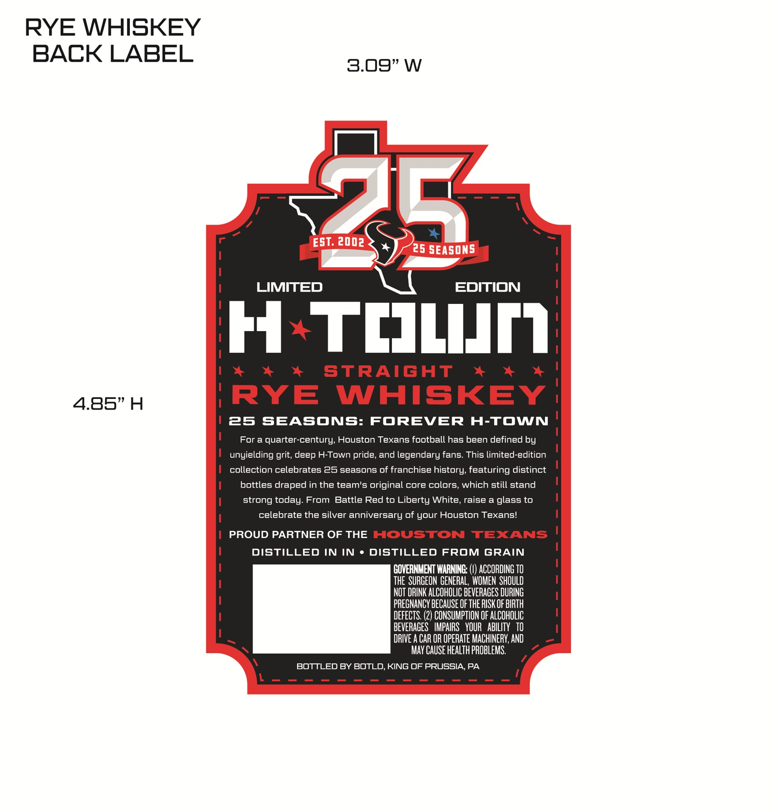
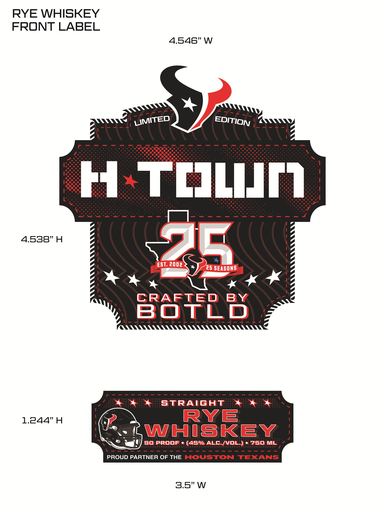

# TTB COLA Label Images - TTBID 26196001000284

**Brand Name:** H TOWN

**Issue Date:** 07/17/2026

**Origin Code:** 39

**Product Class/Type:** 102

**Source:** [TTB Public COLA Registry](https://ttbonline.gov/colasonline/viewColaDetails.do?action=publicFormDisplay&ttbid=26196001000284)

## Label Images

### Back Label

### Label 1

## Extracted Label Text

*Text extracted via OCR - may contain errors*

### Back Label

RYE WHISKEY
BACK LABEL
3.09"W
2
EST: 2002
25 SEASONS
LIMITED
EDITION
H TJLIJM
StRAiGHT
4.85" H
RYE
WHISKEY
25
SEASONS: FOREVER H-TOWN
For a quarter-century; Houston Texans football has been defined by
unyielding grit, deep H-Town pride, and legendary fans: This limited-edition
collection celebrates 25 seasons of franchise history; featuring distinct
bottles draped in the team's original core colors, which still stand
strong today: From Battle Red to Liberty White, raise a glass to
celebrate the silver anniversary Of your Houston Texans!
PROUD PARTNER OF THE HOUSTON
TEXANS
DISTILLED IN IN
DISTILLED FROM GRAIN
GOVERNMENT WARNING:
ACCORDING TO
The SURGEON GENERAL , WOMEN ShOULD
NOT DRINK ALCOHOLIC BEVERAGES DURING
PREGNANCY bECAUSE OF THE RISK OF BIRTH
DEFECTS. (2) CONSUMPTION OF ALCOHOLIC
BEVERAGES   IMPAIRS   VOUR   ABILITy   TO
DRIVE A CAR OR OPERATE MACHINERV; AND
May CAUSE health PROBLEMS.
BOTTLED By BOTLD,KING OF PRUSSIA PA

### Label 1

RYE WHISKEY
FRONT LABEL
4.546" W
H
TcLIJN
4.538"H
EST: 2002
25 SEASONS
CRAFTED
BY
BOTLd
straIGhT
1.244"H
RYE
WHISKEY
9oproof
(459 ALC /vOL)
750ML
PROUD PARTNER OF THE HOUSTON TEXANS
3.5"W
LIMITED
EDITION
