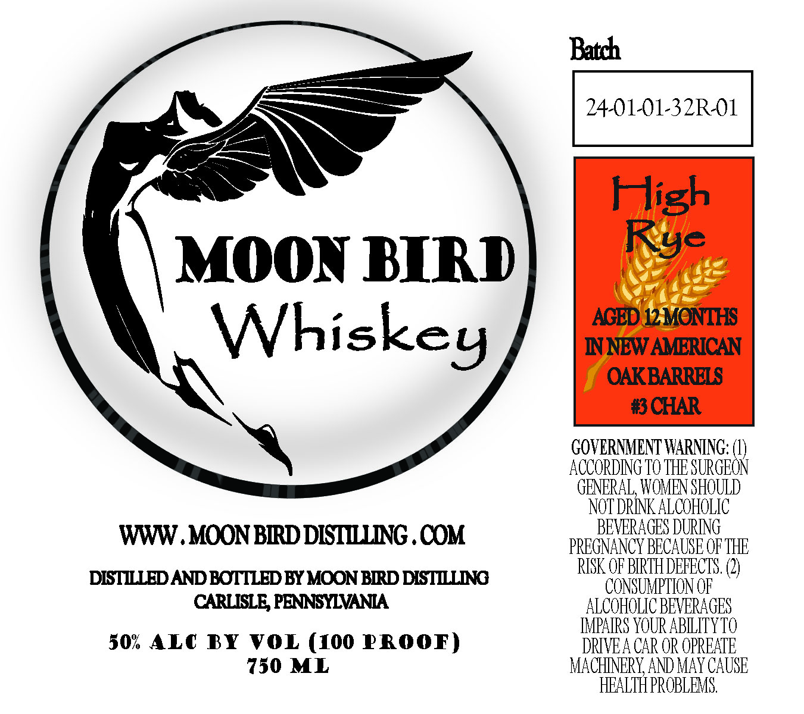

# TTB COLA Label Images - TTBID 26196001000327

**Brand Name:** MOON BIRD WHISKEY

**Fanciful Name:** HIGH RYE AGED 12 MONTHS IN NEW AMERICAN OAK BARRELS #3 CHAR

**Issue Date:** 07/17/2026

**Origin Code:** 39

**Product Class/Type:** 140

**Source:** [TTB Public COLA Registry](https://ttbonline.gov/colasonline/viewColaDetails.do?action=publicFormDisplay&ttbid=26196001000327)

## Label Images

### Label 1

## Extracted Label Text

*Text extracted via OCR - may contain errors*

**Detected Proof:** 100

### Label 1

Batch

a

MOON BIRD

Whiskey

ACC

GOVERNMENT WARNING: (1)

G

HE SURGE

GENERAL, W'

ENS

LUA

LIC

BEVERAGI

G

WWW. MOON BIRD DISTILLING .COM

PREGNANCY BECAUSE OF THE

.

EER

EE

DISTILLED AND BOTTLED BY MOON BIRD DISTILLING

CONSUM

CARLISLE, PENNSYLVANIA.

ALC

LIC BEVERAGES

IMPAIRS YOUR AB

YT

50% ALC BY VOL (100 PROOF)

DRIVEACA

EATE

750 ML

AY CAUSE

MACH E vA

E

Li.

L

i
