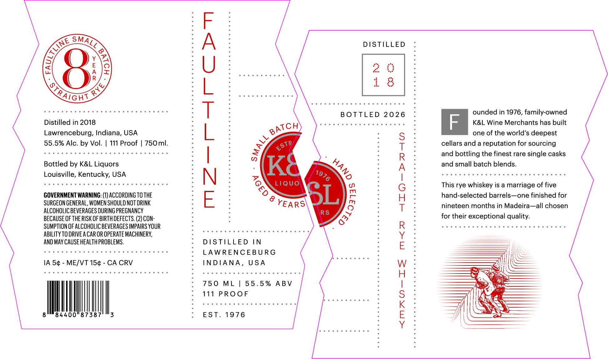
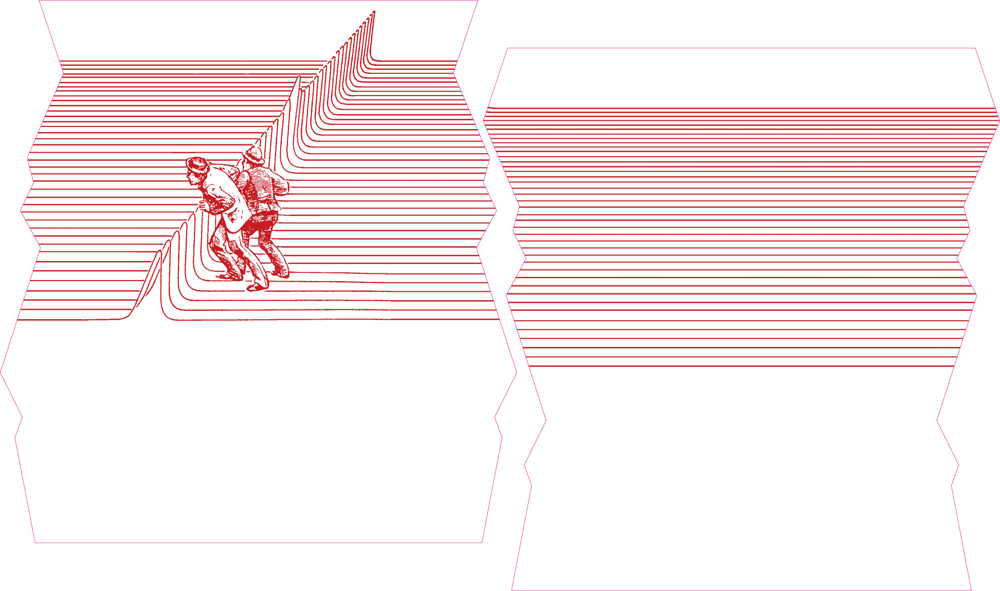

# TTB COLA Label Images - TTBID 26196001000348

**Brand Name:** FAULTLINE

**Issue Date:** 07/17/2026

**Origin Code:** 22

**Product Class/Type:** 102

**Source:** [TTB Public COLA Registry](https://ttbonline.gov/colasonline/viewColaDetails.do?action=publicFormDisplay&ttbid=26196001000348)

## Label Images

### Label 1

### Label 2

## Extracted Label Text

*Text extracted via OCR - may contain errors*

*1 image(s) excluded: text did not meet readability threshold*

**Detected Proof:** 111

### Label 1

<S SMATS : A : DISTILLED °
AY x) . .
s ) wa : U : me |
= A Jz : DS oa satad aie am |:
; ): : : : 4p [5
o %, | : ole, A
vs) A é i :
Trane : bone e eee eens :
CC GRTS YRWS TONS PRET BUST FOR Ese : T : BOTTLED 2026 : ounded in 1976, family-owned
Distilled in 2018 : : {CH Hows KOSS MOSES coms eT F K&L Wine Merchants has built
Lawrenceburg, Indiana, USA 8 | é he e : S : one of the world’s deepest
55.5% Alc. by Vol. | 111 Proof | 750ml. : : & li : T : cellars and a reputation for sourcing
Penne eee meee eee eee en en eees : | : BT / > ¢ . 5 R : and bottling the finest rare single casks
Bottled by K&L Liquors : : a | K ras - 4, : A : and small batch blends.
Louisville, Kentucky, USA : N : > Neen GAS : le suis UG Gales TOG RaW MORE eaME exe
CS TOE CHO LORS WERE HERS Hens KON ° : ONG 1Quo eo — \ o : G : This rye whiskey is a marriage of five
GOVERNMENT WARNING: (1) ACCORDING 10 THE : FE : “ac — >| r ] pa : H: hand-selected barrels—one finished for
SURGEON GENERAL, WOMEN SHOULD NOT DRINK ‘ : EARS\ Wee H : ‘aah ahs In MMadalrs Al Eh;
ALCOHOLIC BEVERAGES DURING PREGNANCY : : rs Ajj i 6 3 aii ee
BECAUSE OF THE RISK OF BIRTH DEFECTS. (2) CON- : : Ake : : for their exceptional quality.
SUMPTION OF ALCOHOLIC BEVERAGES IMPAIRS YOUR c *~ . : R: SHEE Saree Ree lations Slee Sleisie Steels Sieie
ABILITY TO DRIVE A CAR OR OPERATE MACHINERY, gS ee 2 es 2 ESS ae ey : Y:
AND MAY CAUSE HEALTH PROBLEMS. : DISTILLED IN : E: ———
Decne eee eee e reese essen eoee : LAWRENCEBURG G g ie
1A 5¢ - ME/VT 15¢ - CA CRV : INDIANA, USA a: Wee ——s (SS
Bisa oe saree tate ie saciae aaoieus eeera Sene : BGezes WESUEIN wUleKsiN eneieue sieved exes : H: yy SS
: 750 ML | 55.5% ABV : | : ——— hn
: 111 PROOF : S: =i &
3 84400'87387. 3 : EST. 1976 ; BE ¢ AN a
: Y: —
