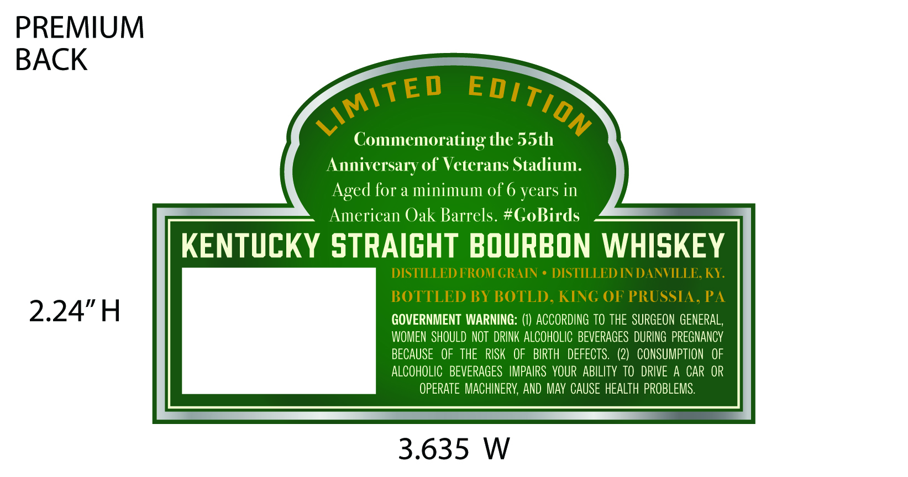
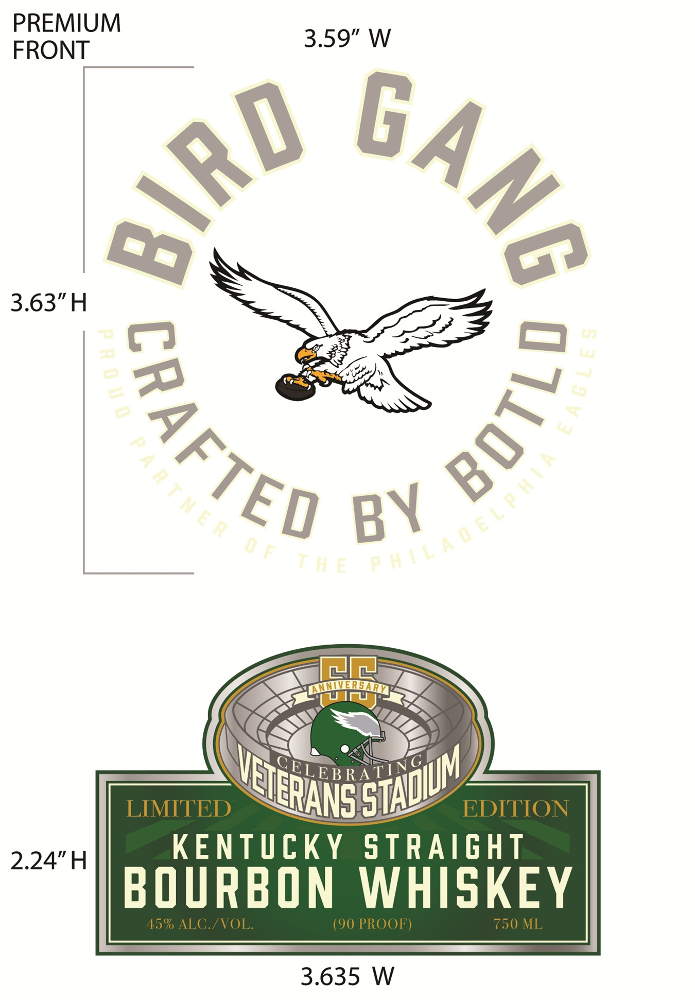

# TTB COLA Label Images - TTBID 26196001000359

**Brand Name:** BIRD GANG

**Issue Date:** 07/20/2026

**Origin Code:** 39

**Product Class/Type:** 101

**Source:** [TTB Public COLA Registry](https://ttbonline.gov/colasonline/viewColaDetails.do?action=publicFormDisplay&ttbid=26196001000359)

## Label Images

### Back Label

### Front Label

## Extracted Label Text

*Text extracted via OCR - may contain errors*

**Detected Proof:** 90

### Back Label

PREMIUM
BACK
Commemorating the 55th
Anniversary of Vetcrans Stadium.
Aged for a minimum of6 years in
American Oak Barrels. #GoBirds
KENTUCKY STRAIGHT BOURBON WHISKEY
DISTILLED FROM GRAIN
DISTILLED IN DANVILLE, KY
BOTTLED BY BOTLD, KING OF PRUSSIA, PA
2.24"H
GOVERNMENT WARNING: (I) ACCORDING TO THE  SURGEON GENERAL,
WOMEN   SHOULD NOT DRINK ALCOHOLIC BEVERAGES  DURING  PREGNANCY
BECAUSE   OF  THE   RISK   OF   BIRTH   DEFECTS.   (2)   CONSUMPTION  OF
ALCOHOLIC  BEVERAGES   IMPAIRS   VOUR   ABILITY TO  DRIVE A CAR OR
OPERATE MACHINERV, AND Mav CAUSE HEALTh PROBLEMS.
3.635
W
LimItED
EDITION

### Front Label

PREMIUM
3.59" W
FRONT
3.63"H

LNNVVERHARM
U
SELEBRATYAGI
LIMITED
EDITION
2.24"H
KENTUcKY
STRAIGht
BOURBON
WHISKEY
45% ALC /VOL
(90 PROOF)
750 ML
3.635
W
GAng
04RO
5
7
3
3
6

BY
m

STADUM
VETERANS =
