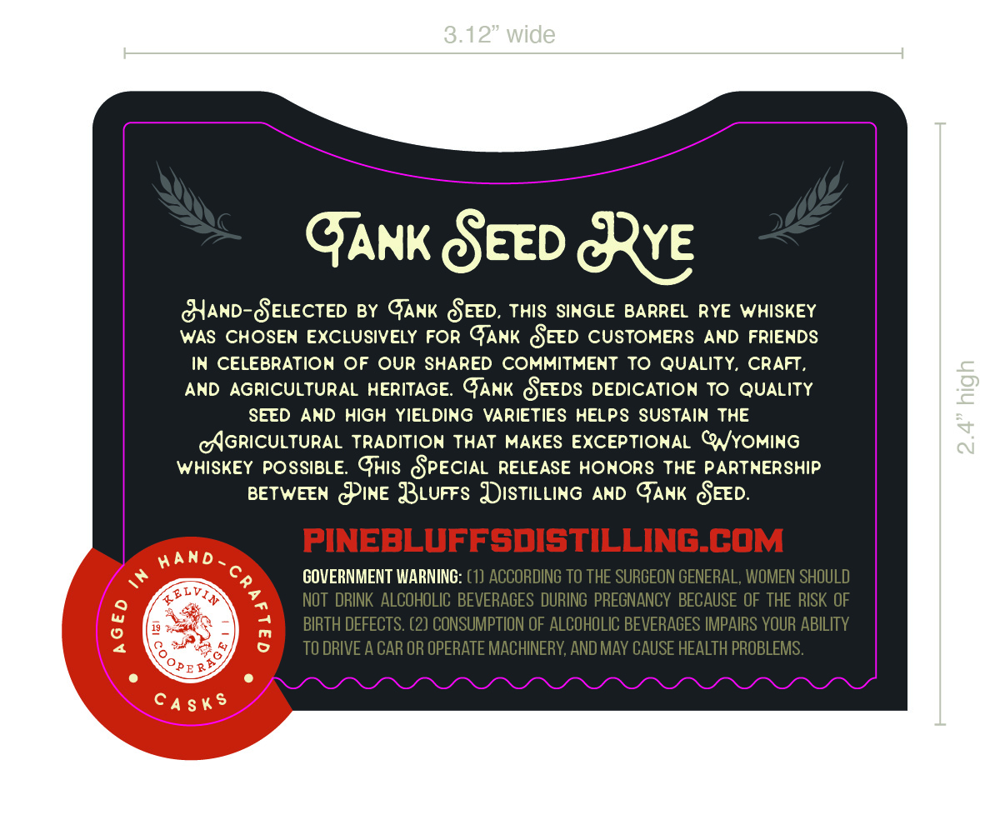
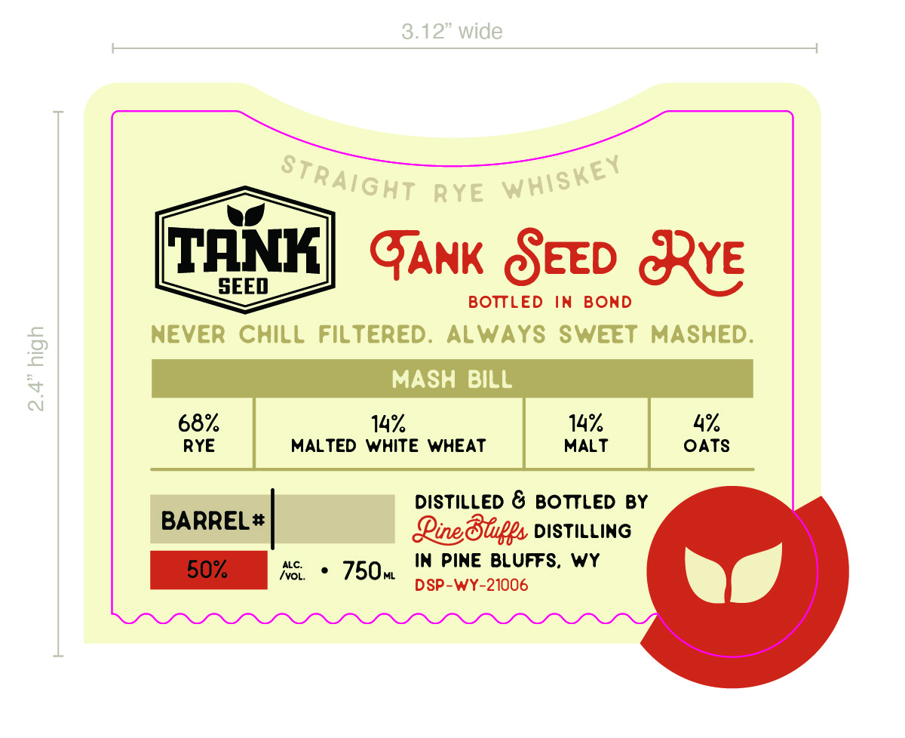

# TTB COLA Label Images - TTBID 26196001000608

**Brand Name:** PINE BLUFFS DISTILLING

**Fanciful Name:** TANK SEED RYE BOTTLED IN BOND

**Issue Date:** 07/22/2026

**Origin Code:** 49

**Product Class/Type:** 112

**Source:** [TTB Public COLA Registry](https://ttbonline.gov/colasonline/viewColaDetails.do?action=publicFormDisplay&ttbid=26196001000608)

## Label Images

### Back Label

### Front Label

### Label 3

## Extracted Label Text

*Text extracted via OCR - may contain errors*

*1 image(s) excluded: text did not meet readability threshold*

**Detected Proof:** 136

### Back Label

3.12" wide
GANK CEED &ye
GIAND-SELECTED BY GANK CEED, THIS SINGLE
BARREL
RYE WHiSKEY
WAS CHOSEN
EXCLUSIVELY
FOR
GANK CEED CUSTOMERS
AND
FRIENDS
IN CELEBRATION
Of OuR SHARED COMMITMENT
To QUALiTY,
CRAFT,
AND
AGRICULTURAL HERITAGE: GANK CEEDS DEDICATION
TO QUALITY
2
SEED
AND
HIGh YIELDING
VARIETIES HELPS SUSTAIN
THE
CAGRICULTURAL TRADITION
THAT
MAKES EXCEPTIONAL CNYOMING
~
WHISKEY POSSIBLE. GHIS CPECIAL RELEASE HONORS THE PARTNERSHIP
BETWEEN
TINE BurFs UIStILLING
AND
GANK SEED:
PINEBLUFFsdISTILLING COM
HanD
40
GOVERNMENT WARNING: (1) ACCORDING To THE SURGEON GENERAL, WOMEN SHOULD
4eLVIA
NoT DRINK   ALCOHOLIC BEVERAGES DURING PREGNANCY BECAUSE OF THE RISK OF
BIRTH DEFECTS. (2) CONSUMPTION OF ALCOHOLIC BEVERAGES IMPAIRS YOUR ABILITY
TO DRIVE A CAR OR OPERATE MACHINERY, AND MAY CAUSE HEALTH PROBLEMS.
PE R
CA
8
8
34
S k $

### Front Label

3.12" wide
RYE
TANK
GANK CEED &ve
SEED
BOTTLED
In
BOHD
NevER
CHiLL
Filtered.
ALWAYS SWEET
MASHED:
2
MASH
BILL
4
68%
14
14%
4%
RYE
MALTED WHITE WHEAT
MALT
OATS
DistiLLEd & BOTTLED
BY
BARREL #
Qinedhupps DISTILLING
50%
ALC:
750w
In Pine BLUFFS,
wy
IvoL:
DSP-WY-21006
Straight
whiskey
