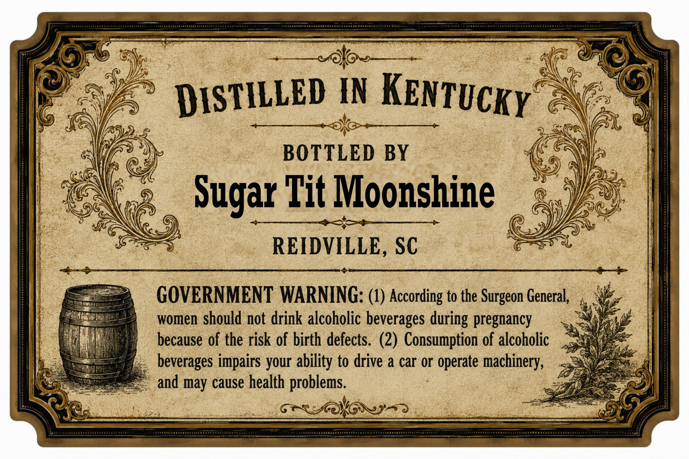
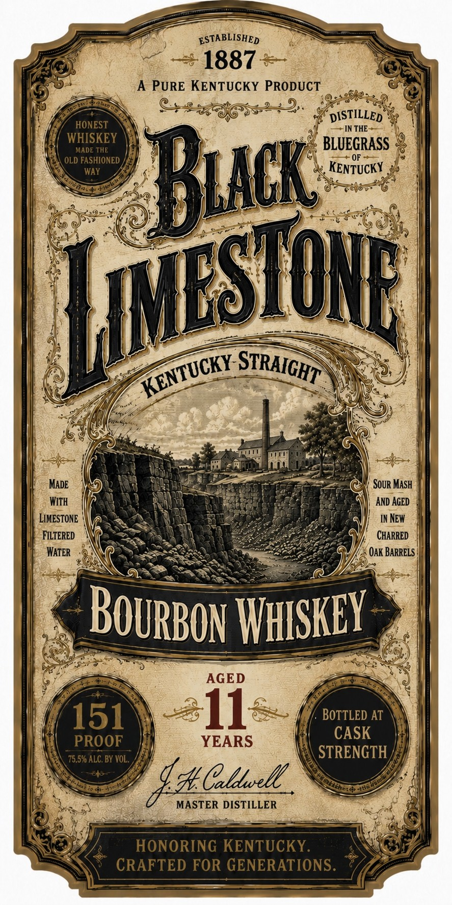

# TTB COLA Label Images - TTBID 26196001000637

**Brand Name:** BLACK LIMESTONE

**Issue Date:** 07/28/2026

**Origin Code:** 41

**Product Class/Type:** 101

**Source:** [TTB Public COLA Registry](https://ttbonline.gov/colasonline/viewColaDetails.do?action=publicFormDisplay&ttbid=26196001000637)

## Label Images

### Back Label

### Front Label

## Extracted Label Text

*Text extracted via OCR - may contain errors*

**Detected Proof:** 151

### Back Label

DISTILLED IN
BOTTLED BY
Sugar Tit Moonshine
REIDVILLE, SC
GOVERNMENT WARNING: (4) According to the Surgeon General,
women should not drink alcoholic beverages during pregnancy
because of the risk of birth defects. (2) Consumption of alcoholic
beverages impairs your ability to drive a car or operate machinery,
and may cause health problems.
KENTUcKy

### Front Label

ESTABLISHED
1887
A PURE KENTUCKY PRODUCT
DISTILLED
HONEST
IN THE
WHISKEY
BLUEGRASS
MADE THE
OLD FASHIONED
OF
WAY
KENTUCKY
Buck
MAdE
Sour Mash
WIth
AND AGED
LIMESTONE
IN New
FILTERED
CHARRED
WaTeR
Oak BARRELS
THISKEy
AGED
151
11
BOTTLED AT
CASK
PROOF
YEARS
75.5% ALC. BY VOL;
STRENGTH
4@ CulL_
MASTER DISTILLER
HONORING KENTUCKY.
CRAFTED FOR GENERATIONS.
IIESHOne
STRAIGHT
KENTUCKY
BOURBOn
