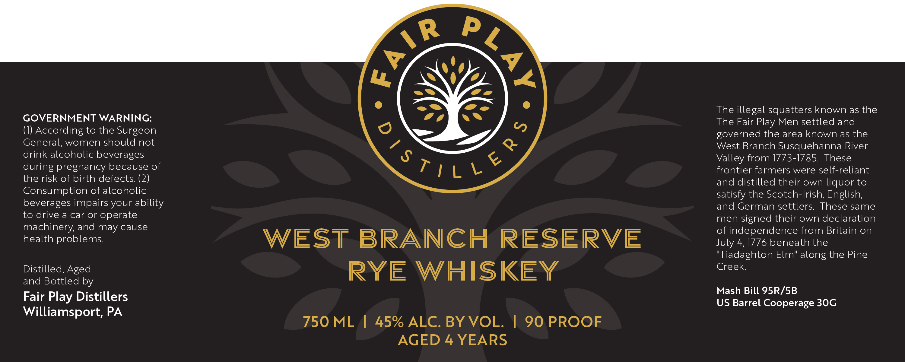

# TTB COLA Label Images - TTBID 26196001000668

**Brand Name:** FAIR PLAY DISTILLERS

**Issue Date:** 07/17/2026

**Origin Code:** 39

**Product Class/Type:** 142

**Source:** [TTB Public COLA Registry](https://ttbonline.gov/colasonline/viewColaDetails.do?action=publicFormDisplay&ttbid=26196001000668)

## Label Images

### Label 1

## Extracted Label Text

*Text extracted via OCR - may contain errors*

**Detected Proof:** 90
**Detected Age:** 4 Years

### Label 1

P
U
The illegal squatters known as the
GOVERNMENT WARNING:
The Fair
Men settled and
(1) According to the Surgeon
0
governed the area known as the
General; women should not
&
West Branch Susquehanna River
drink alcoholic beverages
Valley from 1773-1785. These
during pregnancy because of
frontier farmers were self-reliant
the risk of birth defects: (2)
and distilled their own liquor to
Consumption of alcoholic
satisfy the Scotch-Irish, English;
beverages impairs your ability
and German settlers. These same
to drive a car or
operate
men signed their own declaration
machinery, and may cause
of independence from Britain on
health problems
WEST
BRANCHH
RESERVE
July 4,1776 beneath the
"Tiadaghton Elm" along the Pine
Distilled, Aged
RYE WHISKEY
Creek
and Bottled by
Mash Bill 95R/SB
Fair Play Distillers
US Barrel Cooperage 30G
Williamsport, PA
750 ML
45% ALC. BY VOL.
90 PROOF
AGED 4 YEARS
AIR
5
Play
'sTTL ~
