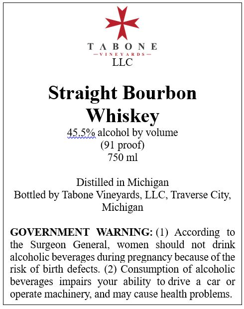

# TTB COLA Label Images - TTBID 26196001000748

**Brand Name:** TABONE VINEYARDS

**Issue Date:** 07/21/2026

**Origin Code:** 06

**Product Class/Type:** 101

**Source:** [TTB Public COLA Registry](https://ttbonline.gov/colasonline/viewColaDetails.do?action=publicFormDisplay&ttbid=26196001000748)

## Label Images

### Label 1

## Extracted Label Text

*Text extracted via OCR - may contain errors*

**Detected Proof:** 91

### Label 1

TABONE

VINEYARDS

Straight Bourbon

Whiskey

45.5% alcohol by volume

(91 proof)

750 ml

Distilled in Michigan

Bottled by Tabone Vineyards, LLC, Traverse City,

Michigan

GOVERNMENT WARNING: (1) According to

the Surgeon General, women should not drink

alcoholic beverages during pregnancy because of the

risk of birth defects. (2) Consumption of alcoholic

beverages impairs your ability to drive a car or

operate machinery, and may cause health problems.
