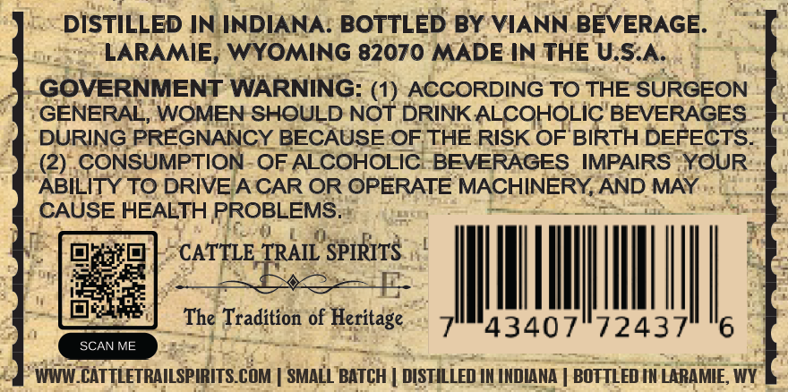
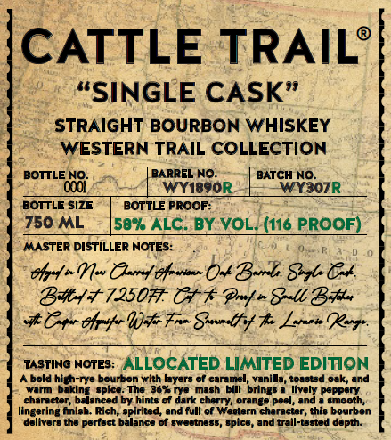
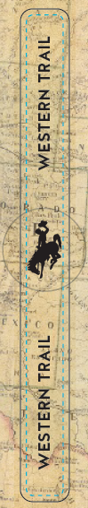

# TTB COLA Label Images - TTBID 26196001000881

**Brand Name:** CATTLE TRAIL

**Issue Date:** 07/17/2026

**Origin Code:** 49

**Product Class/Type:** 101

**Source:** [TTB Public COLA Registry](https://ttbonline.gov/colasonline/viewColaDetails.do?action=publicFormDisplay&ttbid=26196001000881)

## Label Images

### Back Label

### Front Label

### Label 3

## Extracted Label Text

*Text extracted via OCR - may contain errors*

*1 image(s) excluded: text did not meet readability threshold*

**Detected Proof:** 116

### Back Label

DISTILLED IN INDIANA: BOTTLED BY VIANN BEVERAGE:
LARAMIE, WYOMING 82070 MADE IN THE U,S.A:
GOVERNMENT WARNING: (1) ACCORDING TO THE SURGEON
GENERAL; WOMEN SHOULD NOT DRINK ALCOHOLIC BEVERAGES
DURING PREGNANCY BECAUSE OF THE RISK OF BIRTH DEFECTS:
(2) CONSUMPTION-OF ALCOHOLIC
BEVERAGES IMPAIRS YOUR
ABILITY TO DRIVE A CAR OR OPERATE MACHINERY, AND MAY
CAUSE HEALTH PROBLEMS.
CATTLE TRAIL SPIRITS
The Tradition of Heritage
43407
72437
6
SCAN ME
WWW_CATTLETRAILSPIRITS COM
SMALL BATCH
DISTILLED IH IHDIANA
BOTTLED IN LARAMIE, WY

### Front Label

CATTLE TRAIL’
“SINGLE CASK”
STRAIGHT BOURBON WHISKEY

>. WESTERN TRAIL COLLECTION

BOTTLE NO. BARREL NO. BATCH NO.

Saale on 307R

BOTTLE SIZE BOTTLE PROOF:

750 ML 58% ALC. BY: VOL.(116 PROOF)

“MASTER DISTILLER NOTES: Dries R

- Oped] » Vor Choire fan Ook Bards. Sole Col

BH 12507 Of Poof » Spell Bef

AO Cfptpe Wit Frm Sint ef te Lemoe Repo

Rae ee a
“TASTING NoTEs: ALLOCATED LIMITED EDITION

‘Abold high-rys bourbon with layers of caramel, vanilla, toasted oak, and

am bing Saat TOS Vie ok McIngee hon Perper

ceavopeteelantedion ties! ot fan curr Wermotions ds seme
lingering finish. Rich, spirited, and full of Western character, this bourbon

‘delivers the perfect balance of sweetness, spice, and trail-tasted depth.
