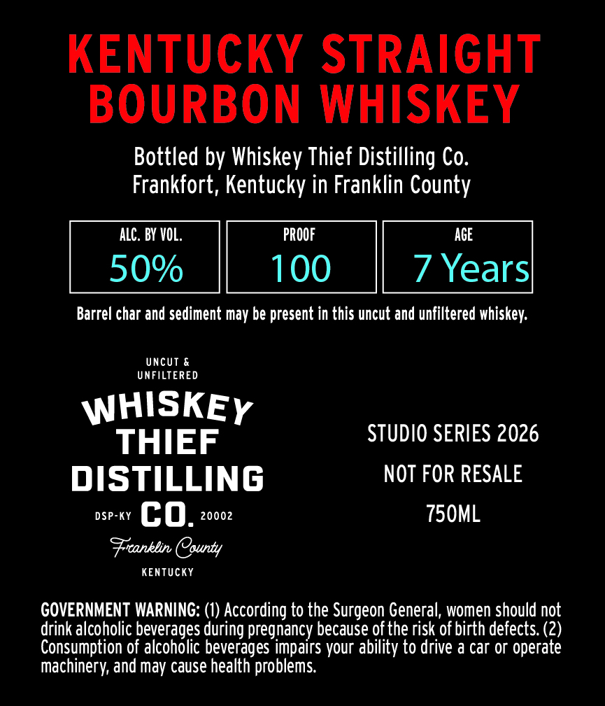
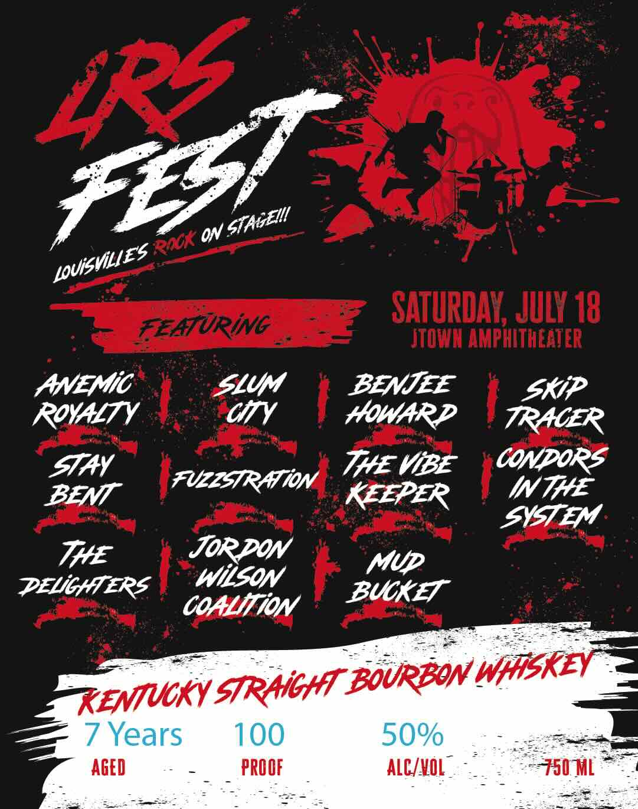

# TTB COLA Label Images - TTBID 26197001000095

**Brand Name:** WHISKEY THIEF DISTILLING CO.

**Fanciful Name:** LRS FEST

**Issue Date:** 07/20/2026

**Origin Code:** 22

**Product Class/Type:** 101

**Source:** [TTB Public COLA Registry](https://ttbonline.gov/colasonline/viewColaDetails.do?action=publicFormDisplay&ttbid=26197001000095)

## Label Images

### Back Label

### Front Label

## Extracted Label Text

*Text extracted via OCR - may contain errors*

**Detected Proof:** 100
**Detected Age:** 7 Years

### Back Label

KENTUCKY STRAIGHT
BOURBON WHISKEY

Bottled by Whiskey Thief Distilling Co.
Frankfort, Kentucky in Franklin County

ALC. BY VOL. PROOF AGE
50% 100 7 Years

Barrel char and sediment may be present in this uncut and unfiltered whiskey.

UNCUT &
UNFILTERED

wes SS y STUDIO SERIES 2026
DISTILLING NOT FOR RESALE
oseay GQ, 20002 750ML
Preantlin (County

KENTUCKY

GOVERNMENT WARNING: (1) According to the Surgeon General, women should not
drink alcoholic beverages during pregnancy because of the risk of birth defects. (2)
Consumption of alcoholic beverages impairs your ability to drive a car or operate
Machinery, and may cause health problems.

### Front Label

ON
FEATURiNG
SATURDAY, JULY 18
JTOMM AMPHITHEATER
ANEMiG
SLUm
BENJEE
Skip
ROYALTY
CY
HOWARD
TRAGER
STAY
THE ViBE
CONDORs
BENT
FUZzSTRATiON
KEEPER
INTHE
SYSTEM
THE
JoRRON
Mup
DELGHTERS
Wilson
BUOKET
CoALIiON
KENUCKY STRHGHT ZOURZON WFISKEY
7 Years
100
50%
AGED
PROOF
ALCVOL
750 ML
LRE
357
'STAGEII
Raok
LOUisMiLIES
