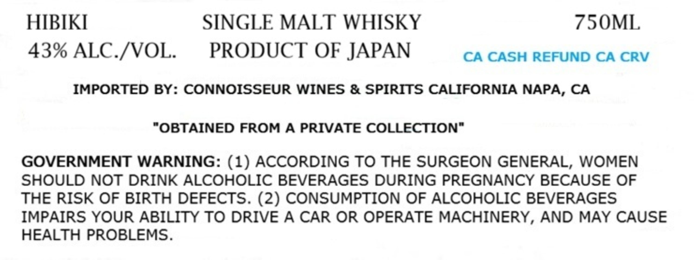
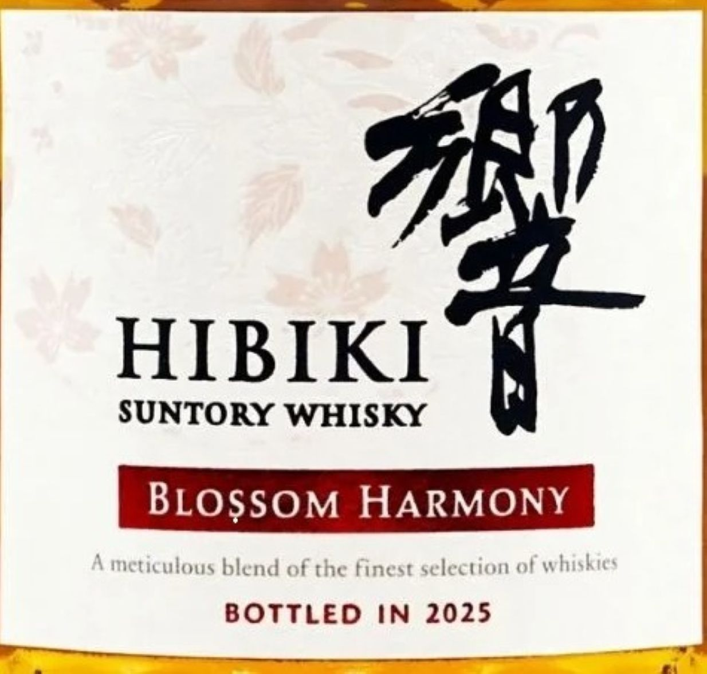

# TTB COLA Label Images - TTBID 26197001000197

**Brand Name:** HIBIKI

**Fanciful Name:** BLOSSOM HARMONY

**Issue Date:** 07/20/2026

**Origin Code:** 59

**Product Class/Type:** 118

**Source:** [TTB Public COLA Registry](https://ttbonline.gov/colasonline/viewColaDetails.do?action=publicFormDisplay&ttbid=26197001000197)

## Label Images

### Label 1

### Label 2

## Extracted Label Text

*Text extracted via OCR - may contain errors*

**Detected Proof:** 86

### Label 1

HIBIKI
SINGLE MALT WHISKY
75OML
43% ALC /VOL.
PRODUCT OF JAPAN
CA CASH REFUND CA CRV
IMPORTED BY: CONNOISSEUR WINES & SPIRITS CALIFORNIA NAPA, CA
"OBTAINED FROM A PRIVATE COLLECTION"
GOVERNMENT WARNING: (1) ACCORDING TO THE SURGEON GENERAL, WOMEN
SHOULD NOT DRINK ALCOHOLIC BEVERAGES DURING PREGNANCY BECAUSE OF
THE RISK OF BIRTH DEFECTS. (2) CONSUMPTION OF ALCOHOLIC BEVERAGES
IMPAIRS YOUR ABILITY TO DRIVE A CAR OR OPERATE MACHINERY, AND MAY CAUSE
HEALTH PROBLEMS.

### Label 2

740
HIBIKI
T
SUNTORY WHISKY
BLOssoM HARMONY
meticulous blend of the Finest selection of whiskies
BOTTLED
IN 2025
