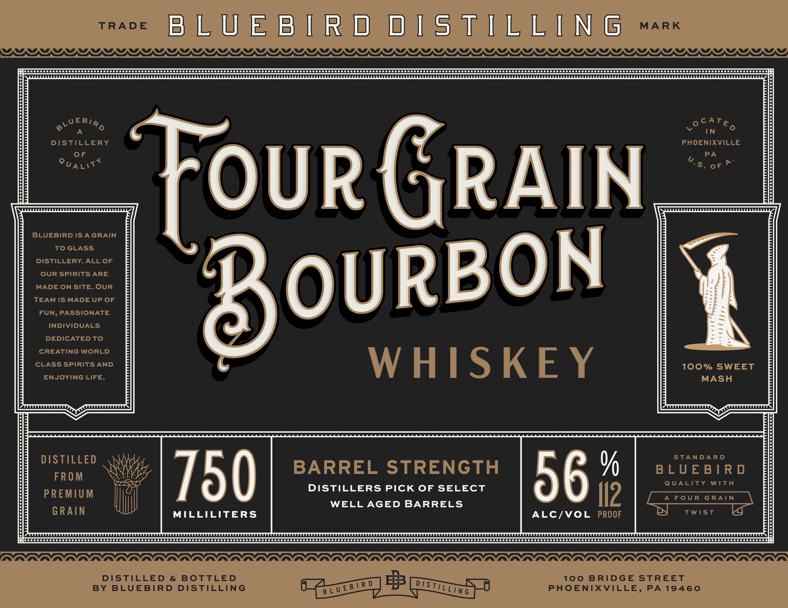
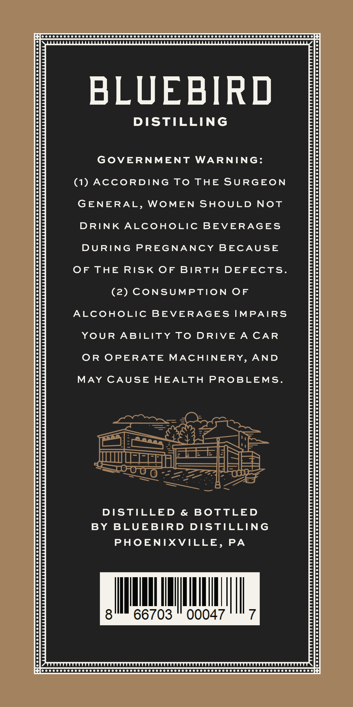
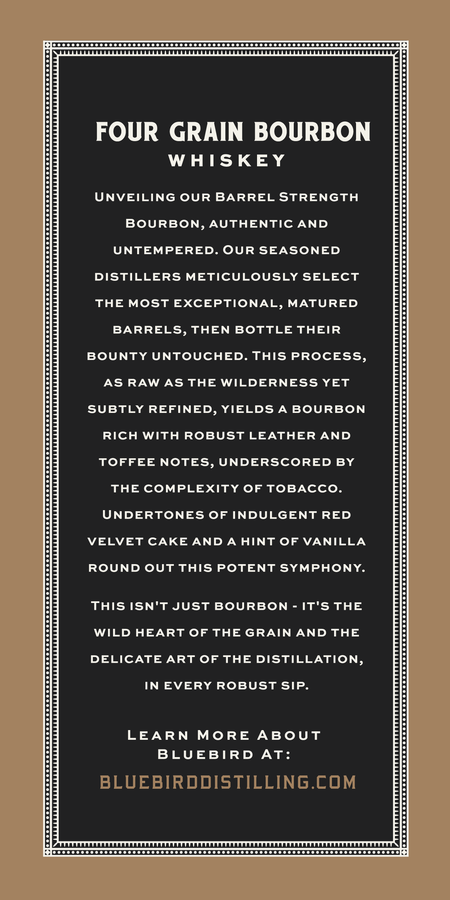

# TTB COLA Label Images - TTBID 26197001000267

**Brand Name:** BLUEBIRD DISTILLING

**Fanciful Name:** FOUR GRAIN BOURBON BARREL STRENGTH

**Issue Date:** 07/20/2026

**Origin Code:** 39

**Product Class/Type:** 141

**Source:** [TTB Public COLA Registry](https://ttbonline.gov/colasonline/viewColaDetails.do?action=publicFormDisplay&ttbid=26197001000267)

## Label Images

### Label 1

### Label 2

### Label 3

## Extracted Label Text

*Text extracted via OCR - may contain errors*

### Label 1

TRADE
B L U E B [ R d
d [ s T[ L L [ N G
MARK
@EYLLYLALLALLALALLALLALLALALLALLALLALALALALLALLALLALALLALLALLALALLALLALLALALLALLALLALLLALYY
&LUEBIRo
0
V
A
TN
DISTILLERY
PHOENIXVILLE
0F
PA
QUALIT '
0F
P
GRAIN
BLUEBIRD IS A GRAIN
To GLASS
DISTILLERY. ALL OF
OUR spirits ARE
TEADE GMADEUPLF
BoURBON
FUN, PASSIONATE
INDIVIDUALS
DEDICATED TO
CREATING WORLD
CLASS SPIRITS AND
WHISKEY
100% SWEET
ENJOYING LIFE.
MASH
DISTILLED
STA NDA R D
BARREL
STRENGTH
%
B L UE B ] R d
FROM
750
DISTILLERS Pick OF SELECT
56
Q UALITY
WiTh
PREMIUM
Il2
A FoU R
G RAIN
WELL AGED BARRELS
GRAIN
MILLILITERS
ALC/VOL
PROOF
TWist
DISTILLED
&
BOtTLED
8
100
BRIDGE STREET
D
BY
BLUEBIRD
DISTILLING
PHOENIXVILLE,
PA
19460
Four
CATE D
U.5 .
D iSTillin g
B L U E B / R

### Label 2

fe 0 00 0000000000000 000000000000 00000 0000000000 000000000000000000000000000008

BLUEBIRD

DISTILLING

GOVERNMENT WARNING:

(1) ACCORDING TO THE SURGEON

GENERAL, WOMEN SHOULD NOT

DRINK ALCOHOLIC BEVERAGES

DURING PREGNANCY BECAUSE

OF THE RISK OF BIRTH DEFECTS.

(2) CONSUMPTION OF

ALCOHOLIC BEVERAGES IMPAIRS

YOUR ABILITY TO DRIVE A CAR

OR OPERATE MACHINERY, AND

MAY CAUSE HEALTH PROBLEMS.

DISTILLED & BOTTLED

BY BLUEBIRD DISTILLING

PHOENIXVILLE, PA

IM

|

Mit

a

66703

00047

ll,

plo ccc cc ccc ceo C CeO SCOOT OOS OT OOOO OOOO OOS SOTTO O OT OOO OOOO DODO DODO OOOO OOOO

### Label 3

fo 0 00 000050000000 0000000000000 00 0000000000000 0000000000000000000000 00000008

FOUR GRAIN BOURBON

WHISKEY

UNVEILING OUR BARREL STRENGTH

BOURBON, AUTHENTIC AND

UNTEMPERED. OUR SEASONED

DISTILLERS METICULOUSLY SELECT

THE MOST EXCEPTIONAL, MATURED

BARRELS, THEN BOTTLE THEIR

BOUNTY UNTOUCHED. THIS PROCESS,

AS RAW AS THE WILDERNESS YET

SUBTLY REFINED, YIELDS A BOURBON

RICH WITH ROBUST LEATHER AND

TOFFEE NOTES, UNDERSCORED BY

THE COMPLEXITY OF TOBACCO.

UNDERTONES OF INDULGENT RED

VELVET CAKE AND A HINT OF VANILLA

ROUND OUT THIS POTENT SYMPHONY.

THIS ISN'T JUST BOURBON - IT'S THE

WILD HEART OF THE GRAIN AND THE

DELICATE ART OF THE DISTILLATION,

IN EVERY ROBUST SIP.

LEARN MORE ABOUT

BLUEBIRD AT:

POC CCCCOOO COSCO OOOO OOOO OOO SOTO TOOT OOOO TOOT O TOO SOTO OOOO OTTO SOD OOOO OOOO ONS
