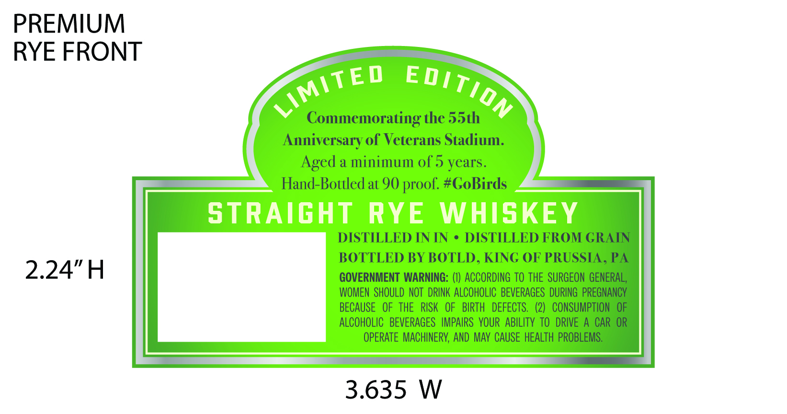
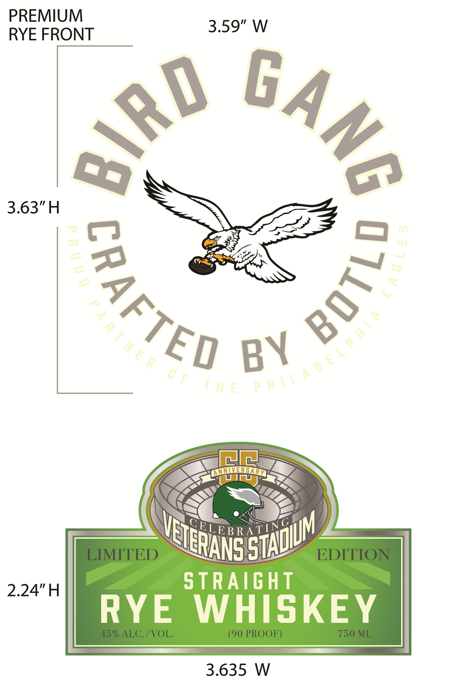

# TTB COLA Label Images - TTBID 26197001000416

**Brand Name:** BIRD GANG

**Issue Date:** 07/20/2026

**Origin Code:** 39

**Product Class/Type:** 102

**Source:** [TTB Public COLA Registry](https://ttbonline.gov/colasonline/viewColaDetails.do?action=publicFormDisplay&ttbid=26197001000416)

## Label Images

### Back Label

### Front Label

## Extracted Label Text

*Text extracted via OCR - may contain errors*

**Detected Proof:** 90
**Detected Age:** 5 Years

### Back Label

PREMIUM
RYE FRONT
Commemorating the 55th
Anniversary of Veterans Stadium:
Aged a minimum of 5 years.
Hand-Bottled at 90 proof. #CoBirds
STRAIGHT
RYE
WHISKEY
DISTILLED IN IN
DISTILLED FROM GRAIN
BOTTLED BY BOTLD , KING OF PRUSSIA , PA
2.24"H
GOVERNMENT WARNING: (1) ACCORDING TO THE SURGEON GENERAL,
WOMEN  SHOULD  NOT  DRINK ALCOHOLIC   BEVERAGES  DURING   PREGNANCY
BECAUSE  OF   THE   RISK   OF   BIRTH   DEFECTS.  (2)  CONSUMPTION   OF
ALCOHOLIC   BEVERAGES   IMPAIRS   VOUR  ABILITY To   DRIVE A CAR OR
OPERATE MACHINERY, AND MAv CAUSE HEALTH PROBLEMS.
3.635
W
LImitED
EDITION

### Front Label

PREMIUM
3.59" W
RYE FRONT
3.63"H

ANNVVERHARM
U
SELEBRATYNG
LIMITED
EDITION
2.24"H
STRAIGHt
RYE
WHISKEY
45% ALC./VOL:
(90 PROOF)
750 ML
3.635
W
6Ang
84RO
2
0
7
3
6

BY
m

STADuM
VEIERAN=
