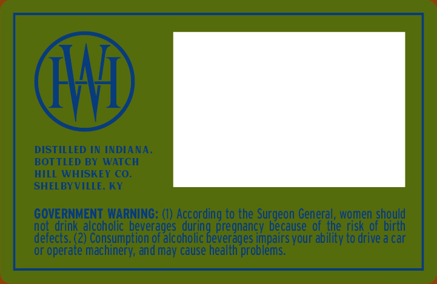
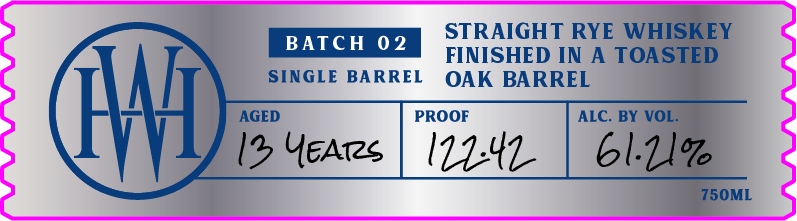

# TTB COLA Label Images - TTBID 26197001000544

**Brand Name:** WATCH HILL WHISKEY CO.

**Fanciful Name:** CHEF SERIES - STRAIGHT RYE WHISKEY FINISHED IN A TOASTED OAK BARREL

**Issue Date:** 07/21/2026

**Origin Code:** 22

**Product Class/Type:** 102

**Source:** [TTB Public COLA Registry](https://ttbonline.gov/colasonline/viewColaDetails.do?action=publicFormDisplay&ttbid=26197001000544)

## Label Images

### Back Label

### Front Label

### Label 3

## Extracted Label Text

*Text extracted via OCR - may contain errors*

*1 image(s) excluded: text did not meet readability threshold*

### Back Label

HHF
DISTILLED IN INDIANA:
BOTTLED BY WATCH
hILL WHISKEY CO_
SHEL BYVILLE. KY
GOVERNMENT WARNING: () According to the Surgeon General, women should
derecrinl
drink_alcoholic beverages
pregnancy because ofathe risk of birth
(2) Consumption of alcoholic
impairs your ability to drive a car
or operate machinery; and may cause health problems:
duringeveragesc

### Front Label

STRAIGHT RYE WHISKEY
BATCH
0 2
FINISHED IN
A TOASTED
SINGLE BARREL
OAK BARREL
HHh
AGED
PROOF
ALC
BY VOL.
12 YEATzs
6l.1l%
750ML
