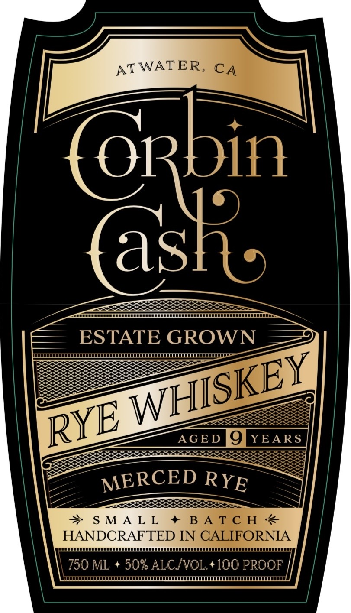
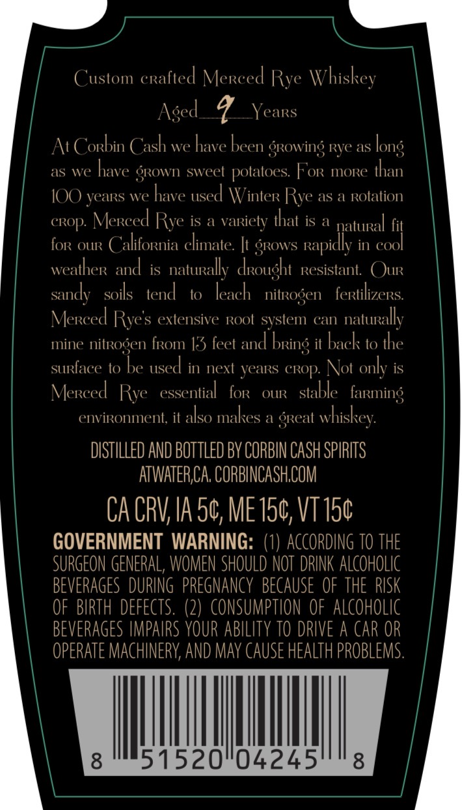
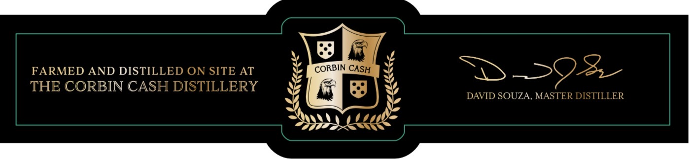

# TTB COLA Label Images - TTBID 26197001000607

**Brand Name:** CORBIN CASH

**Issue Date:** 07/22/2026

**Origin Code:** 01

**Product Class/Type:** 142

**Source:** [TTB Public COLA Registry](https://ttbonline.gov/colasonline/viewColaDetails.do?action=publicFormDisplay&ttbid=26197001000607)

## Label Images

### Label 1

### Label 2

### Label 3

## Extracted Label Text

*Text extracted via OCR - may contain errors*

**Detected Proof:** 100
**Detected Age:** 7 Years

### Label 1

ATWATER, C4

i

a

Peaussuuseussesssscccsssssesssrsssssuennennen

ESTATE GROW

roo

—_—

wHl

excep BJ) vears,

MERCED Rye

as

xs

sererereresese.

SM

LL

sususeuuuuuuusuesssssssesessscsssessssssss

HANDCRAFTED IN

ORNIA

Peer

OF

nee

coor

750 ML + 50% ALC/VOL.+100 PRO

INANEEESUSHAAAAHEEAAAESUSOSUSEESUSUSSUUSESESUSESECEUUUGUEUEEEEEE!

### Label 2

Custom erafted Mereed Rye Whiskey
Aged
7
YeaRs
At Corbin Cash we have been growing Rve as
as we
have grown sweet polatoes: FoR moRe than
IOO years we have used Winter Rye as a Rotation
CROp: Mereed Rve is
vaRiely that is
natuRal fit
foR OUR
California climate: ht grows Rapidly in cool
weatheR and
is
nattiralkv  cxought  Resistant
C(ur
sandy
soils
tend
to
leaeh   nitrogen
fertilizeRs
Mereed Rves extensive Root svstem can
natually
mine nitrogen fRom 13 feet and
it
baek: to the
surface to be used in next yeaRs GRop Not only is
Merced Rve   essential
foR
OUIR
stable   farming
environment, it
also makes a great
whiskey:
DISTILLED AND BOTTtLED BY CORBIN CASH SPIRITS
ATWATER,CA; CORBINCASH,COM
CA CRV; IA 50, ME 150, VT150
GOVERNMENT  WARNING:  (1) ACCORDING TO THE
SURGEON GENERAL, WOMEN SHOULD NOT  DRINK ALCOHOLIC
BEVERAGES DURING   PREgNANCY  BECAUSE  OF THE  RISK
OF  BIRTH defects. (2)   CONSUMPTION OF  alcoholic
BEVERAGES IMPAIRS YOUR abilITy TO DRIVE a CAR OR
OPERATE MACHINERY; AND may CAUSE HEALTh PROBLEMS.
8
51520"04245
8
long
bring

### Label 3

FARMED AND DISTILLED ON SITE AT
3-28
THE CORBIN CASH DISTILLERY
DAVID SOUZA , MASTER DISTILLER
CORBIN
CASH
