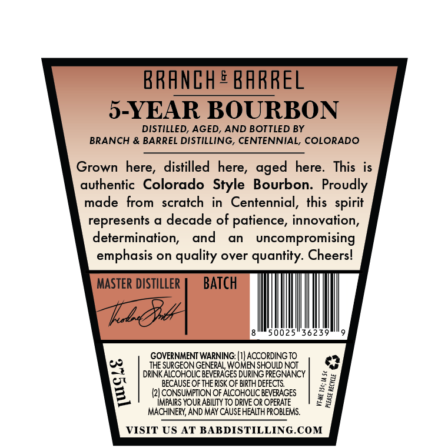
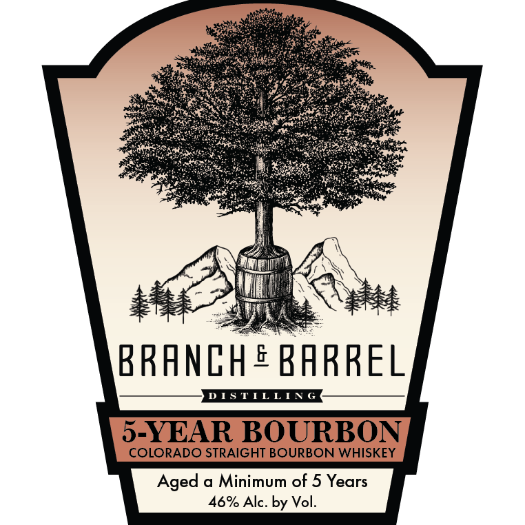

# TTB COLA Label Images - TTBID 26197001000761

**Brand Name:** BRANCH & BARREL

**Issue Date:** 07/21/2026

**Origin Code:** 13

**Product Class/Type:** 101

**Source:** [TTB Public COLA Registry](https://ttbonline.gov/colasonline/viewColaDetails.do?action=publicFormDisplay&ttbid=26197001000761)

## Label Images

### Back Label

### Front Label

## Extracted Label Text

*Text extracted via OCR - may contain errors*

**Detected Proof:** 92
**Detected Age:** 5 Years

### Back Label

BRANCH ® BARREL

3-YEAR BOURBON

DISTILLED, AGED, AND BOTTLED BY

BRANCH & BARREL DISTILLING, CENTENNIAL, COLORADO

Grown here, distilled here, aged here. This is

authentic Colorado Style Bourbon. Proudly

made from scratch in Centennial, this spi

represents a decade of patience, innovation,

determination, and an uncompro

ic)

emphasis on quality over quantity. Cheers!

MASTER DISTILLER

BATCH

LL

jr

50025136239

GOVERNMENT WARNING: (1) ACCORDING TO

THE SURGEON GENERAL WOMEN SHOULD NOT.

a

pet

DRINK ALCOHOLIC BEVERAGES DURING PREGNANCY

Se

BECAUSE OF THE RISK OF BIRTH DEFECTS.

(2] CONSUMPTION OF ALCOHOLIC BEVERAGES:

IMPAIRS YOUR ABILITY TO DRIVE OR OPERATE

3

#3

MACHINERY, AND MAY CAUSE HEALTH PROBLEMS.

VISIT US AT BABDISTILLING.COM

### Front Label

ae ate
Sees. ae
Ce ee
Pp ie eae
ts een ey ae
Ur LET Ke pic Den RCRD pe ee oe a
Se ENG MRS et er ted
ie tee bl Raha ee woke
OO a ORM ro
eh et a Mare
Jie, 4
\ ea LIN
AT TH oO
eae ae
BRANCH ® BARREL
$9
Aged a Minimum of 5 Years
46% Alc. by Vol.
