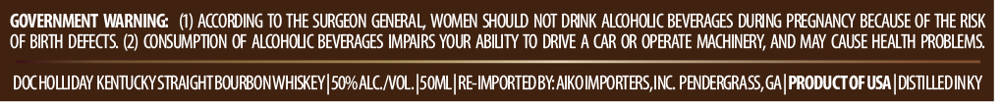
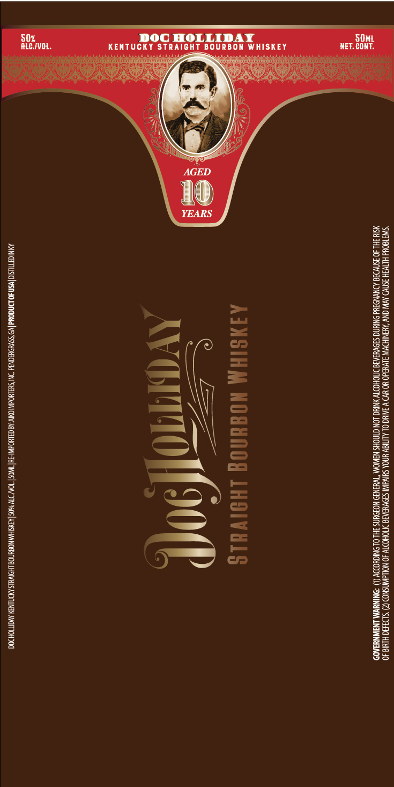

# TTB COLA Label Images - TTBID 26197001000804

**Brand Name:** DOC HOLLIDAY

**Issue Date:** 07/21/2026

**Origin Code:** 08

**Product Class/Type:** 101

**Source:** [TTB Public COLA Registry](https://ttbonline.gov/colasonline/viewColaDetails.do?action=publicFormDisplay&ttbid=26197001000804)

## Label Images

### Back Label

### Front Label

## Extracted Label Text

*Text extracted via OCR - may contain errors*

### Back Label

GOVERNMENT WARNING:   (1) AccORDING TO THE SURGEON GENERAL, WOMEN SHOULD NOT DRUNK ALcOHOLC BEVERAGES DURING PREGNANCY BECAUSE OF THE RISK
OF BIRTH DEFECTS
CONSUMPTION OF ALcoHOLC BEVERAGES IMPAIRS YOUR ABILTY TO DRIE A CAR OR OPERATE MACHINERY; AND MAY CAUSE HEALTH PROBLEMS
DOC HoLLDAY KENTUCKY STRAIGHTBOURBONWHISKEY |5oPALC_NOL.|somLIRE-IMPORTEDBY AIKOIMPORTERS,INC. PENDERGRASS,GA PRODUCTOF USA DISTILLEDINKY

### Front Label

‘SWETEOUd HITV3H 3SNVD AVIN CNV ‘AMSNIHDWW 3LVHdO HO HV) V 3AIUC OL ALITISY YNOA SHIVA! SJOVHIARS INIOHOTY JO NOLLAWNSNOD (2) *S19390 HIM 40.
‘SIH SHL 40 3SNVD30 ADNVNOUd ONTHNG S3DVUAAIS ITIOHOTV YNIUG LON CTNOHS NAWOM\ “TVH3N39 NOIDUNS IHL OL ONIGHODY (1) “DNINUWM LNAWNYAO

AINSIHM NOMHNOG LHDIVHLS

wag (90(P

ANNIGETIUSIG| wsn 40 LNGONd v9 SsyUELONd NI 'SeAL Oa OMY:A8 CaLNOAINI-Tul NOS "ONY JTW 9605 |AYSTHA\NOSWNNOS LHONULS AYDNUNSY AVGITIOHD0G
