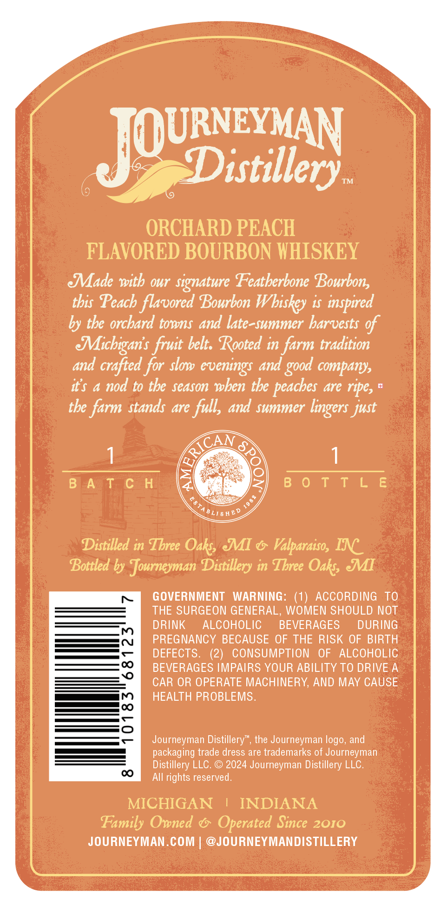
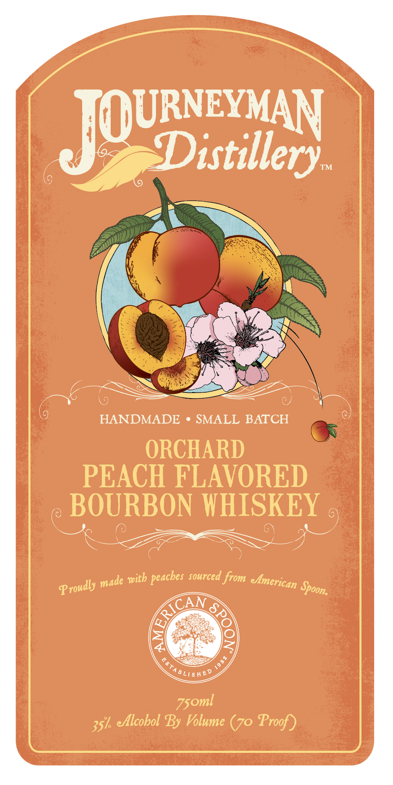

# TTB COLA Label Images - TTBID 26198001000072

**Brand Name:** JOURNEYMAN DISTILLERY

**Fanciful Name:** ORCHARD PEACH FLAVORED BOURBON

**Issue Date:** 07/27/2026

**Origin Code:** 06

**Product Class/Type:** 149

**Source:** [TTB Public COLA Registry](https://ttbonline.gov/colasonline/viewColaDetails.do?action=publicFormDisplay&ttbid=26198001000072)

## Label Images

### Back Label

### Front Label

## Extracted Label Text

*Text extracted via OCR - may contain errors*

**Detected Proof:** 140

### Back Label

JOURisxilery
ORCHARD PEACH
FLAVORED BOURBON WHISKEY
Made with our signature Featherbone Bourbons
tbis Peach flavored Bourbon Wbiskey is inspired
by the orchard towns and late-summer barvests of
Michiganis fruit belt: Rooted in farm tradition
and crafted for slow
and
companys
it$
4
nod to tbe season wben tbe
dre
ripe,
the farm stands are full, and summer
just
8
B]ATCH
B 0 T T L E
HeP
Distilled in Tbree Oaks JMI
Valparaiso, INC
Bottled by Journeyman Distillery in Tbree Oaks JI
GOVERNMENT
WARNING: (1) ACCORDING
TO
THE SURGEON GENERAL, WOMEN SHOULD NOT
DRINK
ALCOHOLIC
BEVERAGES
DURING
PREGNANCY BECAUSE OF THE RISK OF BIRTH
1
DEFECTS.
(2)
CONSUMPTION
OF
ALCOHOLIC
BEVERAGES IMPAIRS YOUR ABILITY TO DRIVE A
CAR OR OPERATE MACHINERY, AND MAY CAUSE
HEALTH PROBLEMS.
3
Journeyman Distillery"
the Journeyman logo, and
packaging trade dress are trademarks of Journeyman
Distillery LLC.
2024 Journeyman Distillery LLC.
0
All rights reserved_
MICHIGAN
INDIANA
Family Owned
Operated Since 2010
JOURNEYMAN COM:
@JOURNEYMANDISTILLERY
good
evenings
peaches
lingers
RICAN
BLI $

### Front Label

Joureer
TM
HANDMADE
SMALL BATCH
ORCHARD
PEACH FLAVORED
BOURBON WHISKEY
sourced from
Spoona
7
35k eAlcobol By Volume (70 Proof)
peaches
with
emerican
made
Proudly
RICAN
8T
BLI
HB:
Z5oml
