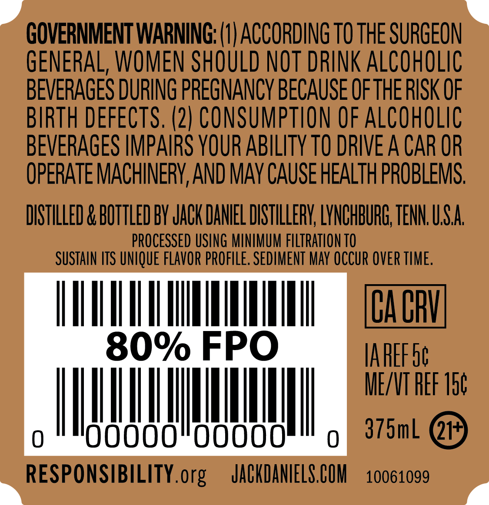
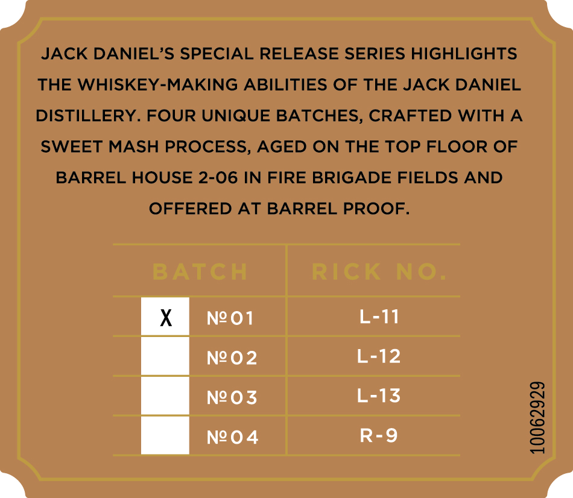
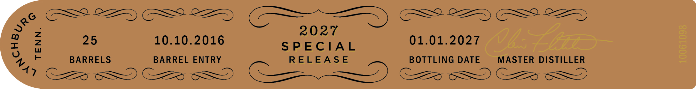

# TTB COLA Label Images - TTBID 26198001000121

**Brand Name:** JACK DANIEL'S

**Fanciful Name:** SPECIAL RELEASE SWEET MASH

**Issue Date:** 07/21/2026

**Origin Code:** 43

**Product Class/Type:** 140

**Source:** [TTB Public COLA Registry](https://ttbonline.gov/colasonline/viewColaDetails.do?action=publicFormDisplay&ttbid=26198001000121)

## Label Images

### Back Label

### Front Label

### Label 4

### Label 5

## Extracted Label Text

*Text extracted via OCR - may contain errors*

**Detected Proof:** 125

### Back Label

GOVERNMENT WARNING: (0| ACCORDING TO THE SURGEON
GENERAL, WOMEN SHOULD NOT DRINK AlcohOlIC
BEVERAGES DURING PREGNANCY BECAUSE OFTHE RISK OF
BIRTH DEFECTS. (2) CONSUMPTION OF AlcohOlic
BEVERAGES IMPARS YOUR ABILITY TO DRIVE A CAR OR
OPERATE MACHINERV,AND MAY CAUSE HEALTH PROBLEMS,
DISTILLED & BOTTLED BY JAcK DANIEL DISTILLERY, LVNCHBURG; TENN USa
PROCESSED USING MINIMUM FILTRATLON TO
SUSTAIN ITS UNIQUE FLAVOR PROFLLE. SEDIMENT May OCCUR OVER TIME:
CA CRH
80% FPO
IAREF 5c
ME/NT EF 15C
Joooo"ooo00
375mL
21_
RESPONSIBILITY.org
JACKDANIELS COM
10061099

### Front Label

SWEET MASH

HIGH PROOF

125 PROOF 62.5 ALC/VOL

### Label 4

JACK DANIEL’S SPECIAL RELEASE SERIES HIGHLIGHTS
THE WHISKEY-MAKING ABILITIES OF THE JACK DANIEL
DISTILLERY. FOUR UNIQUE BATCHES, CRAFTED WITH A
SWEET MASH PROCESS, AGED ON THE TOP FLOOR OF
BARREL HOUSE 2-06 IN FIRE BRIGADE FIELDS AND
OFFERED AT BARREL PROOF.
| x | N20O1 L-11
| | N202 L-12
N
oOo
a

### Label 5

i Gana! (GSS. 2D GSO OED

2027

10.10.2016

SPECIAL

01.01.2027

=

BARRELS

BARREL ENTRY

RELEASE

BOTTLING DATE

MASTER DISTILLER

CGS Ce

SE

24 CZ os Ce SS CS) Cees ca
