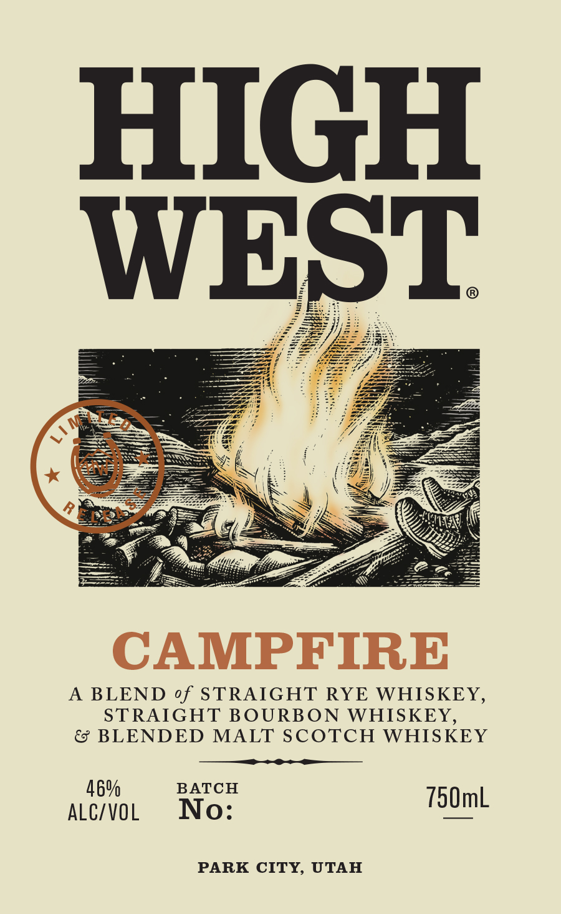

# TTB COLA Label Images - TTBID 26198001000162

**Brand Name:** HIGH WEST

**Fanciful Name:** CAMPFIRE

**Issue Date:** 07/23/2026

**Origin Code:** 00

**Product Class/Type:** 140

**Source:** [TTB Public COLA Registry](https://ttbonline.gov/colasonline/viewColaDetails.do?action=publicFormDisplay&ttbid=26198001000162)

## Label Images

### Label 1

### Label 2

## Extracted Label Text

*Text extracted via OCR - may contain errors*

### Label 1

HIGH
WEST
CAMPFIRE
AS
BLEND of STRAIGHT
RYE WHISKEY,
STRAIGHT BOURBON
WHISKEY,
BLENDED MALT SCOTCH WHISKEY
469
BATCH
ALC/VOL
No:
750mL
PARK CITY,
UTAH

### Label 2

RE-IMPORTED BY: CONNOISSEUR WINES & SPIRITS CALIFORNIA NAPA,CA

"OBTAINED FROM A PRIVATE COLLECTION"

CACASHED REFUND CACRV

GOVERNMENT WARNING: (1) ACCORDING TO THE SURGEON GENERAL, WOMEN

SHOULD NOT DRINK ALCOHOLIC BEVERAGES DURING PREGNANCY BECAUSE OF THE

RISK OF BIRTH DEFECTS. (2) CONSUMPTION OF ALCOHOLIC BEVERAGES IMPAIRS YOUR

ABILITY TO DRIVE A CAR OR OPERATE MACHINERY, AND MAY CAUSE HEALTH PROBLEMS.
