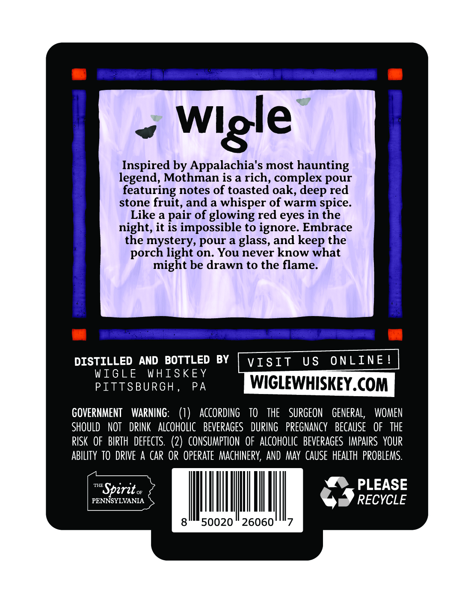
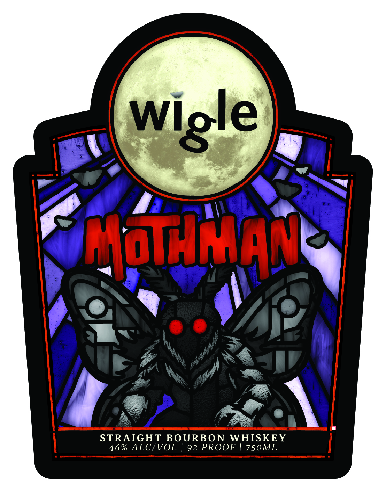

# TTB COLA Label Images - TTBID 26198001000240

**Brand Name:** WIGLE

**Issue Date:** 07/28/2026

**Origin Code:** 39

**Product Class/Type:** 101

**Source:** [TTB Public COLA Registry](https://ttbonline.gov/colasonline/viewColaDetails.do?action=publicFormDisplay&ttbid=26198001000240)

## Label Images

### Back Label

### Front Label

## Extracted Label Text

*Text extracted via OCR - may contain errors*

**Detected Proof:** 92

### Back Label

Inspired by Appalachia's most haunting
legend; Mothman is a rich, complex
featuring notes of toasted oak,
red
stone fruit, and a
whisper of warm spice_
Like a
of glowing red eyes in the
night, it is impossible to ignore: Embrace
the mystery, pour a glass, and keep the
porch light on; You never know what
might be drawn to the flame:
DISTILLED
AND   BOTTLED
BY
VISIt
U $
ONLINE
WIGLE
WHISKEY
PITTSBURGH
PA
WIGLEWHISKEY.COM
GOVERNMENT
WARNING:
()
ACCORdING
TO
THE
SURGEON
GENERAL,
WOMEN
ShOULD
NOT
DRINK
aLcOHOLIC   BevERAGES
DURING
PREGNANCY   BECAUSe
OF   THE
RISK  OF  BIRTH   defects. (2)  CONSUMPTION   OF aLCoHolic  BEVERAGES  IMPAIRS  YOUR
ABLITy TO  DRIVE A CaR OR  operate   MACHINERV, AND  May  CAUSE   HeALTh  PROBLEMS.
THE
Sperit
PLEASE
PENNSYLVANIA
RECYCLE
50020
26060'
Wlgle
pour
deep
pair

### Front Label

Gacham
STRAIGHT BOURBON
WHISKEY
46 % ALCIVOL
92 PROOF
750ML
Wigle
