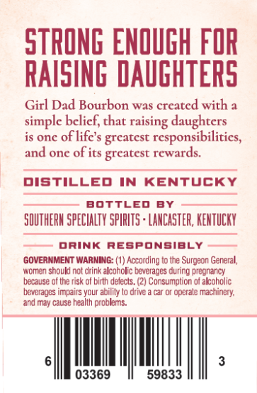
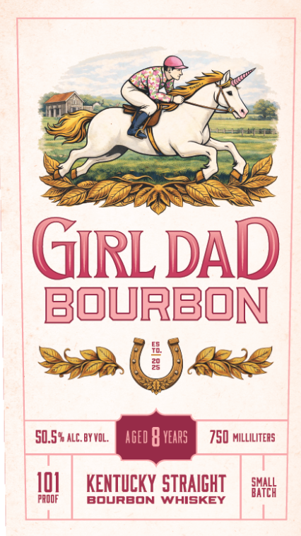

# TTB COLA Label Images - TTBID 26198001000257

**Brand Name:** GIRL DAD

**Issue Date:** 07/29/2026

**Origin Code:** 22

**Product Class/Type:** 101

**Source:** [TTB Public COLA Registry](https://ttbonline.gov/colasonline/viewColaDetails.do?action=publicFormDisplay&ttbid=26198001000257)

## Label Images

### Back Label

### Front Label

## Extracted Label Text

*Text extracted via OCR - may contain errors*

### Back Label

STRONG EnOUGH FOR
RAISING DAUGHTERS
Girl Dad Bourbon was created with a
simple belief, that
daughters
is one oflife s greatest responsibilities,
and one of its greatest rewards:
DISTILLED
IN
KEnTUCKY
BOtTLED
BY
SOUTHERM SPECHALTK SpIRLTS : LANCASTER; KENTUCKY
DRINK ResponsiBLY
GOVERNMENT WARNING: (1) According to the Surgeon General
women should not drink alcoholic beverages during pregnaricy
because
(he risk of birth defects. (2) Consumption of alcoholic
beverages impairs your ability
@rve
operate machinerya
and may cause health problems
03369
59833
-raising

### Front Label

GIRL DAD
bourbon
E
29
50,5% alc_by VOL;
aged
vears
750 williliters
4oL
KENTUCKY STRAIGHT
H
prOOF
BoUrBON WhISKEY
