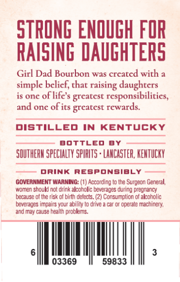
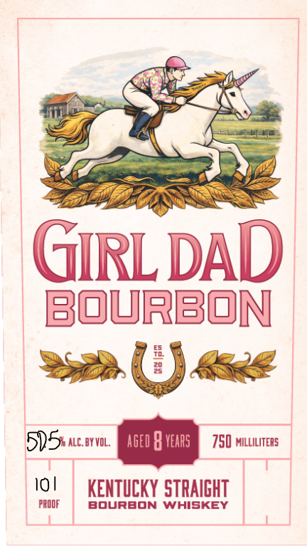

# TTB COLA Label Images - TTBID 26198001000260

**Brand Name:** GIRL DAD

**Issue Date:** 07/30/2026

**Origin Code:** 22

**Product Class/Type:** 101

**Source:** [TTB Public COLA Registry](https://ttbonline.gov/colasonline/viewColaDetails.do?action=publicFormDisplay&ttbid=26198001000260)

## Label Images

### Back Label

### Front Label

## Extracted Label Text

*Text extracted via OCR - may contain errors*

### Back Label

STRONG ENOUGH FOR
RAISING DAUGHTERS
Girl Dad Bourbon was created with a
simple belief, that
daughters
is one of life's greatest responsibilities,
and one of its greatest rewards.
DISTILLED IN
KENTUCKY
BOttLED
BY
SOUTHERH SPECHALTY SpIRLTS + LANCASTER, KEHTUCKY
DRINK
responsibLy
GOVERNMENT WARMING: (1) Accordlng to Ine Surgeon Genteral;
women should not drink alcoholic beverages during pregnancy
because
the risk t
birth detects. (2) Consumption of akcoholic
beverages impairs your ability Io drive
car or operate Machincty;
and may cause heallh
problems:
03369
59833
raising

### Front Label

GRLDAD
bourbon
E
29
515 alc: byvoL:
aged
vears
750 milliliters
10|
KENTUCKY STRAIGHT
PrOOF
BourBOn
WHISKEY
