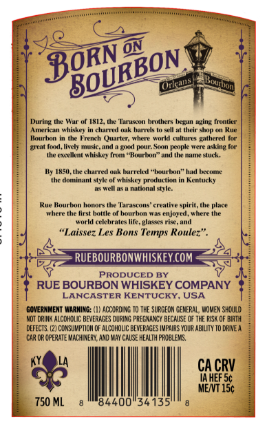
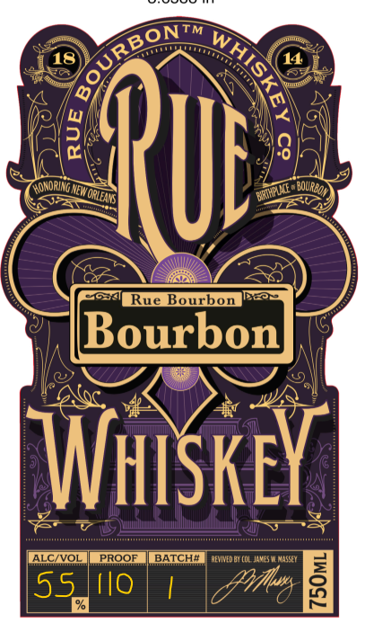

# TTB COLA Label Images - TTBID 26198001000275

**Brand Name:** RUE BOURBON

**Issue Date:** 07/22/2026

**Origin Code:** 22

**Product Class/Type:** 141

**Source:** [TTB Public COLA Registry](https://ttbonline.gov/colasonline/viewColaDetails.do?action=publicFormDisplay&ttbid=26198001000275)

## Label Images

### Back Label

### Front Label

## Extracted Label Text

*Text extracted via OCR - may contain errors*

### Back Label

ON
During the War
1SI2 , thc 'Tarascon hrthers
uging frrtitr
Amcrcn
hiskey
charrlo
harec
sell at their shop on Rue
Kauchon
the French
(uarter
where world cultures
gathered
great faxl,
HuleeIc . M4IIU
LaAI puI; Sa people wen
Ie Het-Ilul
#hiskey
(raut "Roaur Imt" auul Ilwt" QUiuuw" sIuck ,
Uy 1850, thue charred auk burreled "twurbon
#lcumIL
thc dominant styl
Whickc
production in Rentucky
Wclla7a nutiunaitvic;
Rue Kourhon honors the Tarascons"
creative spirit,the place
where he first hottle
hourhon Wus enjoyed, where (he
wurld celehrules Iile. Elasses rise . HuId
"Laissez Les Bons Temps Roulez
RUEBOURBONWHISKEY COM
PRODUCED BY
RUE BOURBON WHISKEY COMPANY
LANCASTER KENTUCKY
USA
GOVERNRJENT WARNING:
ACCO RDLN & T0 THE SURGEOM CENERAL , WOMEN Sh Ould
NOT DRINK ALCDH DUC BEWERaGes DUBING PREENANCY BECauSE QF THE RuSk OF BIRTH
DEFECTS:
COSUMPTION OF ALCOHOLIC BEVERAGES IMPAL RS YDU R ABILTY TO Drive A
CAR OR OPERATE MACHURERN, AY@ RuAY CAUSE HEALTH PROBLEMS.
CA CRV
IAhef 5c
MENT 15c
750 ML
84400"34135'
BORN
BOURBON-
Bouibon
@rlena
Luein
Iely
ini

### Front Label

TM
18
2
BQURBo
563ni
Rue Bourbon
Bourbon
WhiSkey
ALCIVOL
PROQE
BATCH#
AevIVED BY COL JaVes W Masset
55
Io
4
BON=
0
Quf
KoNORINgNEWORLEAS
BRATEL
