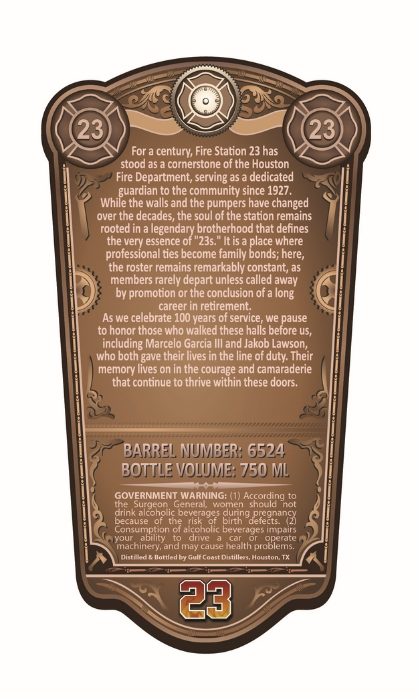
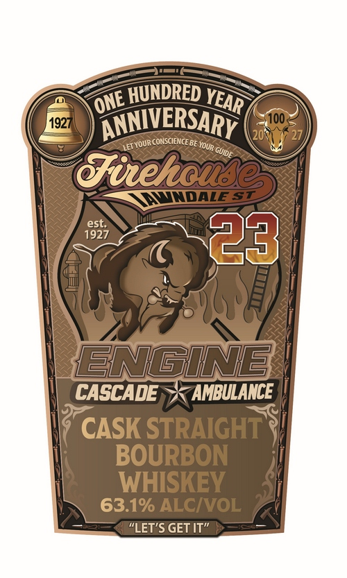
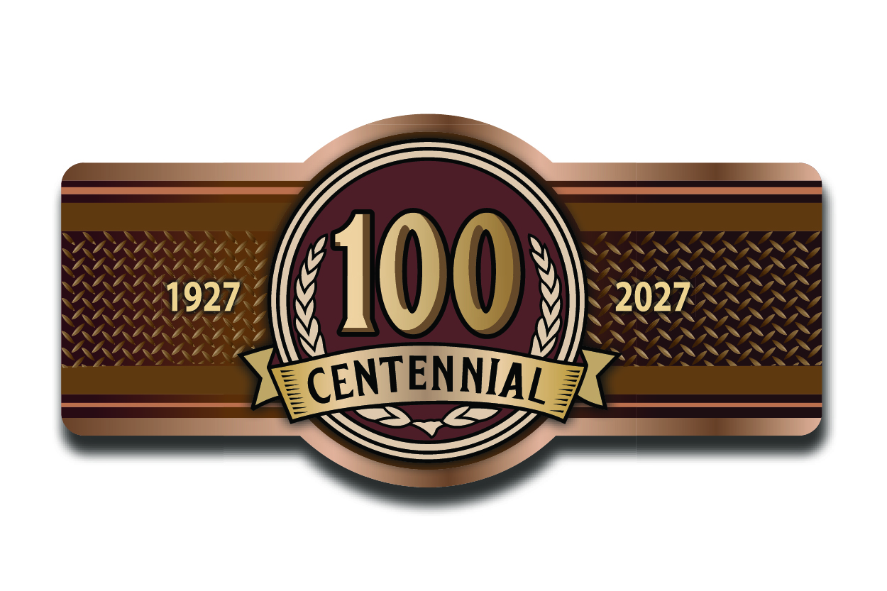

# TTB COLA Label Images - TTBID 26198001000282

**Brand Name:** FIREHOUSE

**Issue Date:** 07/21/2026

**Origin Code:** 44

**Product Class/Type:** 101

**Source:** [TTB Public COLA Registry](https://ttbonline.gov/colasonline/viewColaDetails.do?action=publicFormDisplay&ttbid=26198001000282)

## Label Images

### Back Label

### Front Label

### Label 3

## Extracted Label Text

*Text extracted via OCR - may contain errors*

*1 image(s) excluded: text did not meet readability threshold*

**Detected Proof:** 126.2

### Back Label

23
23
For a century; Fire Station 23 has
stood as a cornerstone of the Houston
Fire Department, serving as
dedicated
guardian to the community since 1927 .
While the walls and the pumpers have changed
over
the decades; the soul of the station remains
rooted in a legendary brotherhood that defines
the very essence of "235.
'It is
place where
professional ties become family bonds; here,
the roster remains remarkably constant; as
members rarely depart unless called away
by promotion or the conclusion of
long
career in retirement;
As we celebrate 100 years of service, we pause
to honor those who walked these halls before uS,
including Marcelo Garcia IIl and Jakob Lawson;
who both gave their lives in the line of
Their
memory lives on in the courage and camaraderie
that continue to thrive within these doors:
BARREL NUMBER: 6524 `
BOTTLE VOLUME: 750 ML
GOVERNMENT WARNING: (1) According to
the
Surgeon
General;
women
should
not
drink alcoholic beverages during pregnancy
because
the risk
of   birth
defects.
of alcoholic beverages impairs
your
yousunbotion
drive
machinery; and may cause health
proerate
Distilled
Bottled by Gulf Coast Distillers
Houstom
23
duty:"

### Front Label

HUNDRED
1927
ANNIVERSARY
100
201
LET VOUR CONSCIENCEBE
TFitekoude
JNDALE S
est:
1927
23
ENGINB
CASCADE
AMBULANCE
CASK STRAIGHT'
BOURBON
WHISKEY
63.1% ALCIVOL
""LET'S GET IT"
YEAR
ONE
YOUR (
GUIde
