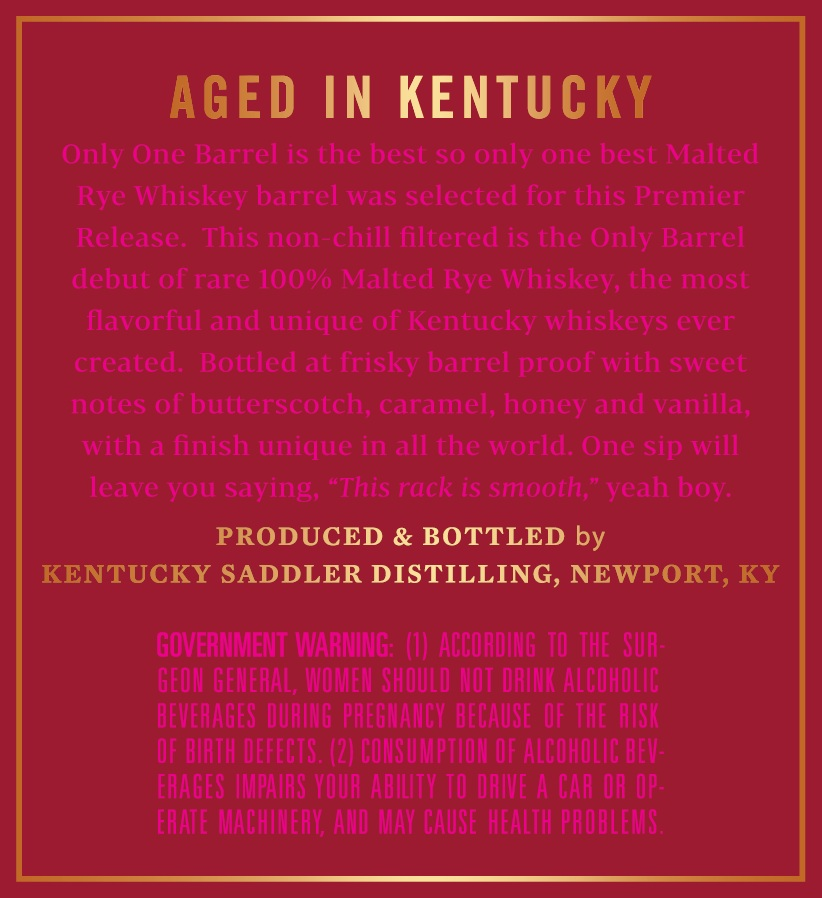
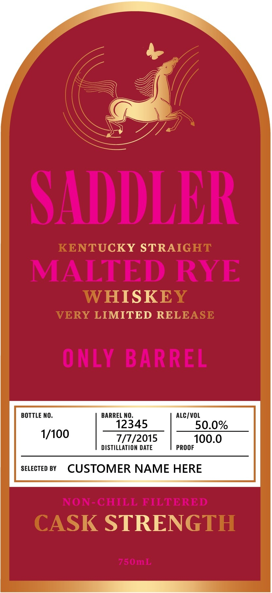
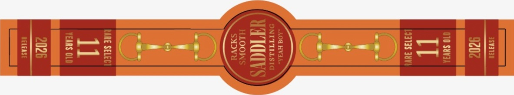

# TTB COLA Label Images - TTBID 26198001000307

**Brand Name:** SADDLER

**Issue Date:** 07/21/2026

**Origin Code:** 22

**Product Class/Type:** 102

**Source:** [TTB Public COLA Registry](https://ttbonline.gov/colasonline/viewColaDetails.do?action=publicFormDisplay&ttbid=26198001000307)

## Label Images

### Back Label

### Front Label

### Label 2

## Extracted Label Text

*Text extracted via OCR - may contain errors*

*1 image(s) excluded: text did not meet readability threshold*

**Detected Proof:** 100

### Back Label

AGED IN KENTUCKY

Only One Barrel is the best so only one best Malted

Rye Whiskey barrel was selected for this Premier

Release. This non-chill filtered is the Only Barrel

debut of rare 100% Malted Rye Whiskey, the most

flavorful and unique of Kentucky whiskeys ever

created. Bottled at frisky barrel proof with sweet

notes of butterscotch, caramel, honey and vanilla,

with a finish unique in all the world. One sip will

leave you saying, “This rack is smooth,” yeah boy.

PRODUCED & BOTTLED by

KENTUCKY SADDLER DISTILLING, NEWPORT, KY

GOVERNMENT WARNING: (1) ACCORDING 10 THE SUR

GEON GENERAL WOMEN SHOULD NOT DRINK ALCOHOLIC

BEVERAGES DURING PREGNANCY BECAUSE OF THE AISK

OF BIRTH DEFECTS. (2) CONSUMPTION OF ALCOHOLIC BEV

ERAGES IMPAIRS YOUR ABILITY TO DRIVE A CAR OR OP

ERATE MACHINERY, AND MAY CAUSE HEALTH PROBLEMS

### Front Label

SADDLER
KENTUCKY STRAIGHT
MALTED RYE
WHISKEY
VERY LIMITED RELEASE
ONLY
BARREL
BOTTLE NO_
BARREL NO.
ALC / VOL
12345
50.0%
1/100
7/7/2015
100.0
DISTILLATION DATE
PROOF
SELECTED BY
CUSTOMER NAME HERE
NON-GHILL FILTERED
CASK STRENGTH
75 OmL
