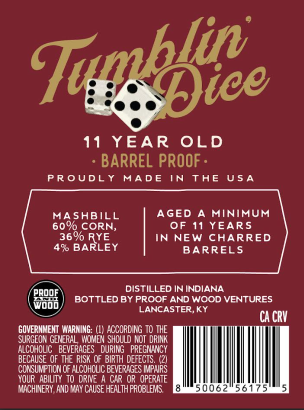
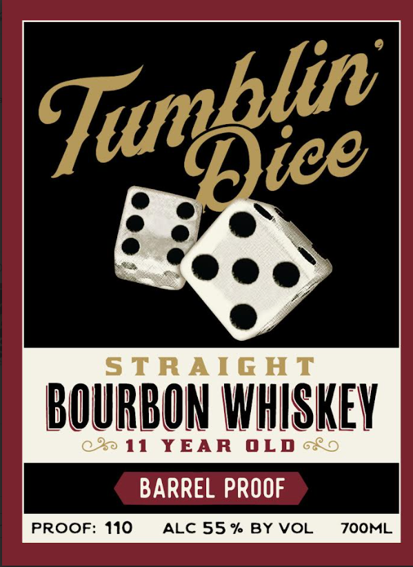

# TTB COLA Label Images - TTBID 26198001000321

**Brand Name:** TUMBLIN DICE

**Issue Date:** 07/22/2026

**Origin Code:** 22

**Product Class/Type:** 101

**Source:** [TTB Public COLA Registry](https://ttbonline.gov/colasonline/viewColaDetails.do?action=publicFormDisplay&ttbid=26198001000321)

## Label Images

### Back Label

### Front Label

## Extracted Label Text

*Text extracted via OCR - may contain errors*

**Detected Proof:** 110
**Detected Age:** 11 Years

### Back Label

Tie pice

11 YEAR OLD
- BARREL PROOF -

PROUDLY MADE IN THE USA

MASHBILL AGED A MINIMUM
60% CORN, OF 11 YEARS

36% RYE IN NEW CHARRED
4% BARLEY BARRELS

GOVERNMENT WARNING: (1) ACCORDING TO THE
SURGEON GENERAL, WOMEN SHOULD NOT DRINK
ALCOHOLIC BEVERAGES DURING PREGNANCY
BECAUSE OF THE RISK OF BIRTH DEFECTS. (2)
CONSUMPTION OF ALCOHOLIC BEVERAGES IMPAIRS
YOUR ABILITY TO DRIVE A CAR OR OPERATE
MACHINERY, AND MAY CAUSE HEALTH PROBLEMS. ame] f-% rad

DISTILLED IN INDIANA
BOTTLED BY PROOF AND WOOD VENTURES.
LANCASTER, KY cA cRV

### Front Label

STRAIG AT
BOURBON WHISKEY
0 0
11
YEAR
OLD
BARREL PROOF
PROOF: 110
ALC 55 % BY VOL
ZOOML
Tumblic|
