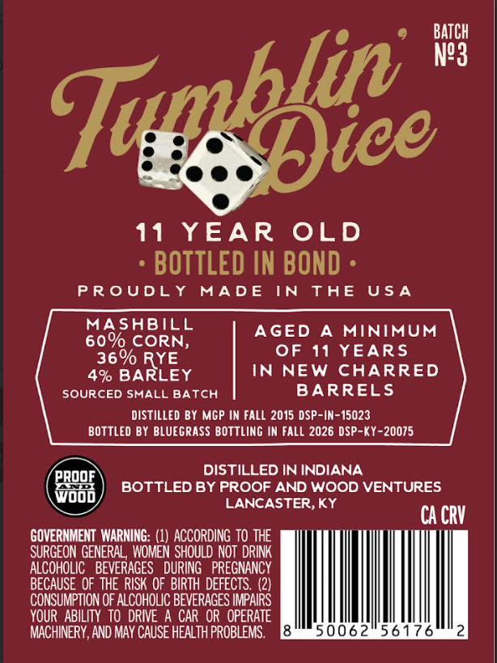
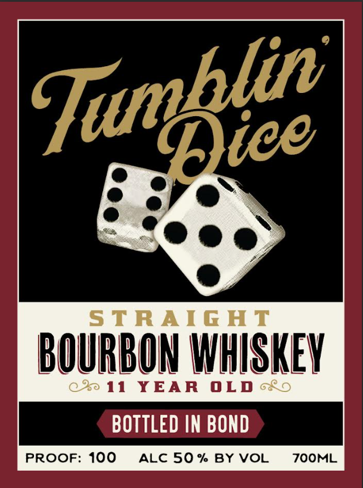

# TTB COLA Label Images - TTBID 26198001000329

**Brand Name:** TUMBIN DICE

**Issue Date:** 07/22/2026

**Origin Code:** 22

**Product Class/Type:** 111

**Source:** [TTB Public COLA Registry](https://ttbonline.gov/colasonline/viewColaDetails.do?action=publicFormDisplay&ttbid=26198001000329)

## Label Images

### Back Label

### Front Label

## Extracted Label Text

*Text extracted via OCR - may contain errors*

**Detected Proof:** 100
**Detected Age:** 11 Years

### Back Label

e BATCH
lift ™
11 YEAR OLD
+ BOTTLED IN BOND -
PROUDLY MADE IN THE USA
MASHBILL
60% CORN, AGED A MINIMUM
BECCIRYE OF 11 YEARS
4% ey IN NEW CHARRED
SOURCED SMALL BATCH BARRELS
DISTILLED BY MGP IN FALL 2015 DSP-IN-15023
BOTTLED BY BLUEGRASS BOTTLING IN FALL 2026 DSP-KY-20075
DISTILLED IN INDIANA
Feen) BOTTLED BY PROOF AND WOOD VENTURES
woop LANCASTER, KY
CACRY
GOVERNMENT WARNING: (1) ACCORDING TO THE
SURGEON GENERAL, WOMEN SHOULD NOT DRINK
ALCOHOLIC BEVERAGES DURING PREGNANCY
BECAUSE OF THE RISK OF BIRTH DEFECTS. (2)
CONSUMPTION OF ALCOHOLIC BEVERAGES IMPAIRS
YOUR ABILITY TO DRIVE A CAR OR OPERATE
MACHINERY, AND MAY CAUSE HEALTH PROBLEMS. Esai -Sy-Sus-103 dhe

### Front Label

StRAIG AT
BOURBON WHISKEV
90 11
YEAR
0LD
BOTTLED IN BOND
PROOF: 100
ALC 50 %
BY VOL
ZOOML
Tumblie
