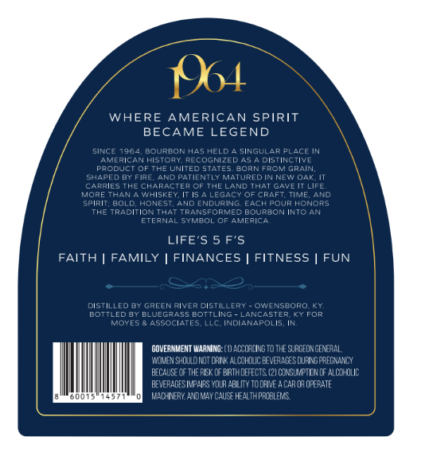
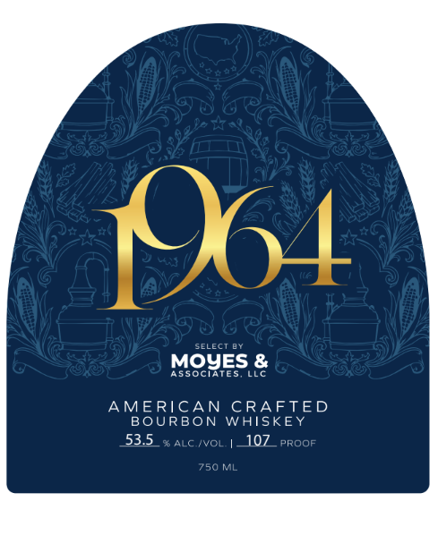

# TTB COLA Label Images - TTBID 26198001000349

**Brand Name:** 1964

**Issue Date:** 07/21/2026

**Origin Code:** 22

**Product Class/Type:** 141

**Source:** [TTB Public COLA Registry](https://ttbonline.gov/colasonline/viewColaDetails.do?action=publicFormDisplay&ttbid=26198001000349)

## Label Images

### Back Label

### Front Label

## Extracted Label Text

*Text extracted via OCR - may contain errors*

### Back Label

04
WHERE AMERICAN SPIRIT
BECAME LEGEND
SINCE
7964
BOURBON HAS
HELC
SINGULARPLACE IN
Mepican
Histoay
RGCOcNized
DISTINCTIVE
PAODUcT Of the United STATES
BOPNTROM GPAIN
Shaped By Fire
ANDPCTIENTLY MCTUREDIN NET O4k IT
CRRIES
ThECHARACTEA CF THELAND
THAI
Gave
Life
ape
Thn
WhISkET ITIS
Legacy OF
CRaFt TIME; ANO
spiri: BuLD
HONES
ANL
ENURINS
EACH POUR HONORS
Tke Traditionthat
TRANSFORMED BOURBON INTO AN
ETFANAL
Symeoi
Lafaic_
LIFE'S 5 F'S
FAITH
FAMILY
FINANCES
FITNESS
FUN
DiSTILLFD BY Greenrivercistillery
OWENSBORO KY
BOTTLEDBy BLuEGAGSS BoTTLING
CNCASTEF
Fop
MOYES
ASSOCIATES LLC INDIZNEPOLIS
GOVERNMETT MARMNG: ( 1) @LCOFING To THE SJAGEONGEEALL ,
TCMIEN SholoKoT LRI X ALCOMDIC EEVEAACCSUFNGPREGNUANCY
BECAUSE CF THE RESK @ ERTHDEFECTS (21 OINSLIXPTIJN @F AlolhlIC
BEVERAGESIMPAIFS YOLR ABLMTV TODFIVE = CAR OA OFERATE
MACHINERY AVdMLY CauSE health pfaLeNS

### Front Label

14
CELECT
MOYES &
Associates
ILC
AMERICAN CRAFTED
BOURBON
WAISKEY
53.5
ALC 'VCL
410Z
PROOF
750 ML
