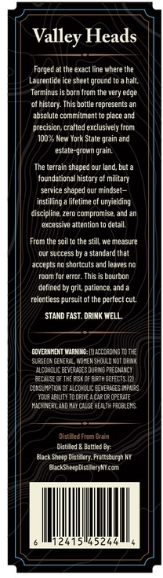
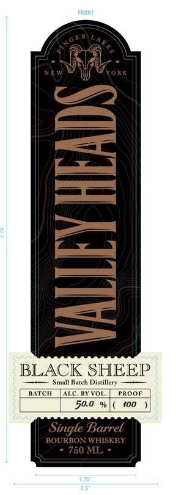

# TTB COLA Label Images - TTBID 26198001000591

**Brand Name:** BLACK SHEEP DISTILLERY

**Fanciful Name:** VALLEY HEADS BOURBON

**Issue Date:** 07/22/2026

**Origin Code:** 02

**Product Class/Type:** 141

**Source:** [TTB Public COLA Registry](https://ttbonline.gov/colasonline/viewColaDetails.do?action=publicFormDisplay&ttbid=26198001000591)

## Label Images

### Back Label

### Front Label

## Extracted Label Text

*Text extracted via OCR - may contain errors*

### Back Label

Heads
Forged at the exact Tine where the
Laurentide ice sheet grcund`
ahalt,
Termirus is born L
the very edge
of history- This bottle represents an
absc lule commiiment Io place and
precisioncralted exclusively Iron
100% Mew York State grain and
estate-grown grain
The terrain shaped Cur land Luta
toundalional histcry ol military
Seryice snaned outMindsel
instilling
lifelime
unjielding
discipline,zero Compromise,and
excessive attention
detail
Frcm the soil Io the slill we ir easure
dur success
standard thal
Jccrots
shortcuts and Ieaves no
for error. This is bourbon
defined
qtL, pabence
relentless
ol the perfeci cul
STAMD FAST. DRINK WELL
GqveeMieNT WarhInS: |Ucoteo"g ToT4
Nieeoieceeenmaeshmmneatr
Hicmmicemeeecniipa  pecmn
EtLaLt
BiTh CEFECTS (2|
Cons_MptiNce Lcl
ceteaIGES ERIS
Tulataivi To crme acroroper4te
Woner adiTolX hewlap calehs
Dteedetaen
Distiled & Botile 81.
Dack Sheep Lesttlery. Prettscurgh HT
Back ShctopisieryWcon
244
Valley
Hconi
purcuit

### Front Label

FRONT
]
BLACK SHEEP
Small Batch Distillery
BATCH
ALC
VOI
PRoor
50.0
{00
Single Barrel
BOURBON WHISKEY
750 ML
