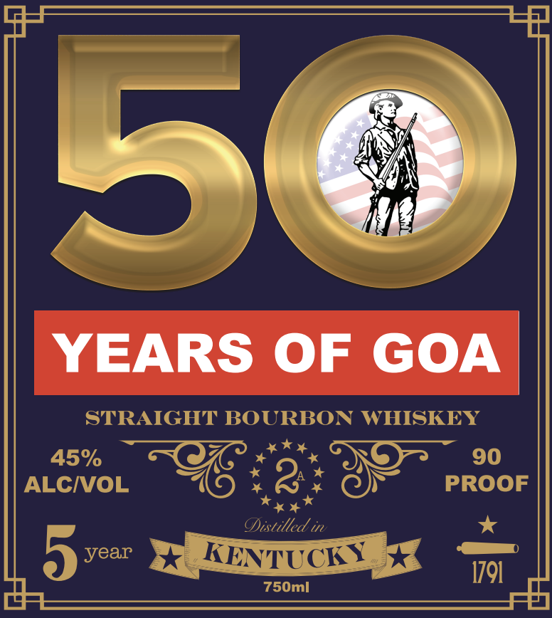
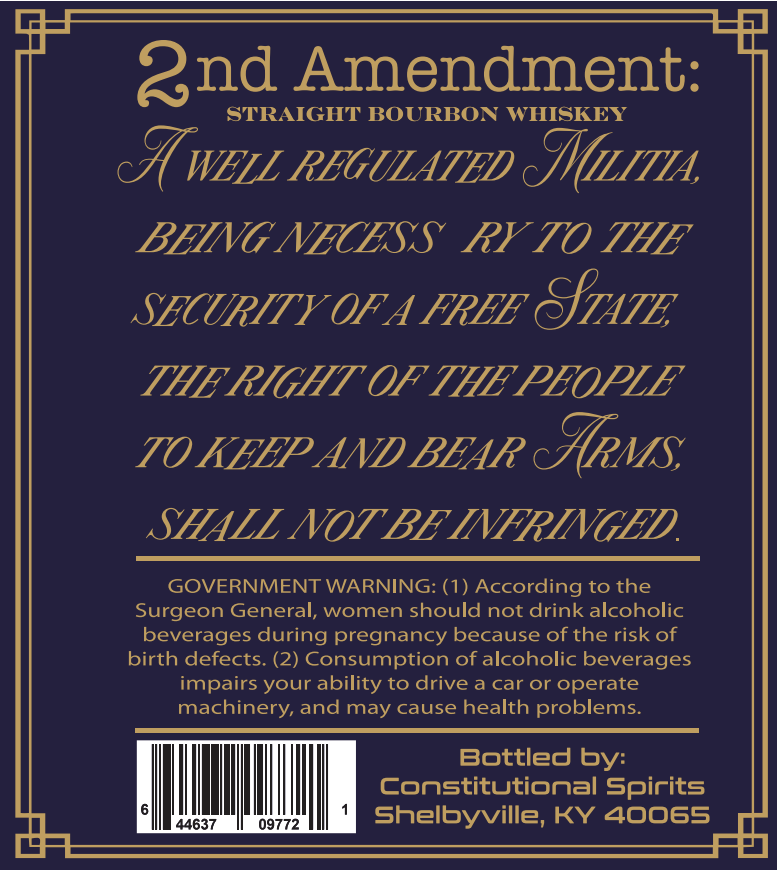

# TTB COLA Label Images - TTBID 26198001000601

**Brand Name:** 50 YEARS OF GOA

**Issue Date:** 07/22/2026

**Origin Code:** 22

**Product Class/Type:** 101

**Source:** [TTB Public COLA Registry](https://ttbonline.gov/colasonline/viewColaDetails.do?action=publicFormDisplay&ttbid=26198001000601)

## Label Images

### Label 1

### Label 2

## Extracted Label Text

*Text extracted via OCR - may contain errors*

**Detected Proof:** 90
**Detected Age:** 5 Years

### Label 1

5
YEARS OF
GOA
STRAIGHT BOURBON WHISKEY
45%
90
ALCIVOL
2
PROOF
Cistilled in
5
year
KENTUCKY
1791
750ml

### Label 2

Qnd Amendment:
STRAIGHT BOURBON
WHISKEY
 WEIL REGULATED IM1ITIA
BEING NECESS
RY TO THE
SECURITY OF A FREE
GTATE
THE RIGHT OF THE PEOPLE
TO KEEP AND BEAR
crMs
SHALL NOT BE INFRINGED
GOVERNMENT WARNING: (1) According to the
Surgeon General, women should not drink alcoholic
beverages during pregnancy because of the risk of
birth defects: (2) Consumption of alcoholic beverages
impairs your ability to drive a car or operate
machinery, and may cause health problems:
Bottled
Constitutional Spirits
44637
09772
Sheibyville, KY 40065
by:
