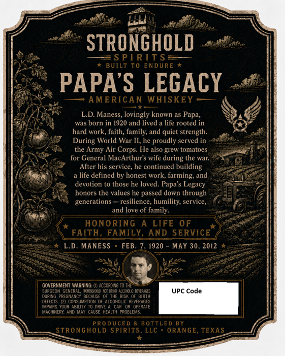
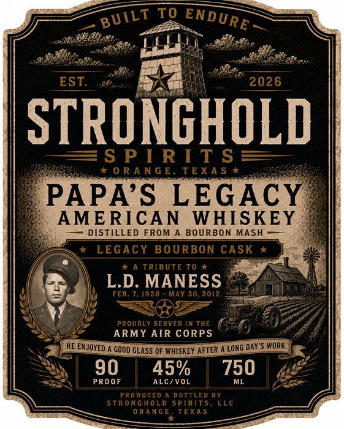

# TTB COLA Label Images - TTBID 26198001000623

**Brand Name:** STRONGHOLD SPIRITS

**Fanciful Name:** PAPA'S LEGACY AMERICAN WHISKEY

**Issue Date:** 07/24/2026

**Origin Code:** 44

**Product Class/Type:** 140

**Source:** [TTB Public COLA Registry](https://ttbonline.gov/colasonline/viewColaDetails.do?action=publicFormDisplay&ttbid=26198001000623)

## Label Images

### Back Label

### Front Label

## Extracted Label Text

*Text extracted via OCR - may contain errors*

**Detected Proof:** 90

### Back Label

STRONGHOLD
S P[ RIT S
BUILT
To
ENDURE
PAPAS LEGACY
AMERICAN WHISKEY
LD
lovingly known as Papa
was born in 1920 and lived
life rooted in
hard work, faith; family; and quiet strength:
During World War II, he proudly served in
the Army Air Corps: He also grew tomatoes
for General MacArthur $ wife during the war
After his service, he continued building
life defined by honest work, farming
and
devotion to those he loved. Papa'$
honors the values he passed down through
generations
resilience; humility; service,
and love of family.
ONORING
A LIFE 0F
FAITH, FAMILY, AND SERVICE
L.D. MANESS
FEB
7, 1920
MAY 30, 2012
GOVERNMENT WaRNNG:
KCCCRLING
Secrot
Geuerai
Lc
alccOlC Bliriges
UPC Code
Luait
PREGNANC
BECAUSE
THE RISK
BIRTH
LefECis
cunsumACI
AlcoHOLIC BEVERAGES
Mpalae
our Aaility T0 dane
Car Or OpeRaTE
MachINARI
and MaY cause Health probleMS
PRODUCED & BOTTLED BY
STRONGHOLD SPIRITS
LLC
ORANGE, TEXAS
Maness;
Legacy

### Front Label

To
EST;
2026
STRONGHOLD
S P [ R I T $
0 R A N G E, TEXA $
PAPAS
LEGAcy
AMERICAN
WHISKEY
DISTILLED FROM
BOURBON MASH
LEGAcy BOURBON CASK
I A TRIBUTE To
L.D: MANESS
FEB. 7, 1920
MAY 30, 2012
PROUDLY SERVED IN THE
ARMY AIR CORPS
HE EMJOYED
GOOD GLASS OF WHISKEY AFTER
LONG DAY"S WorK:
90
45%
750
PRO 0F
ALC/VOL
ML
PRO DUCED & BOTTLED BY
STRONGHOLd SPIRITS
LLc
ORAnGE
TEXAS
BUILT
ENDURE
