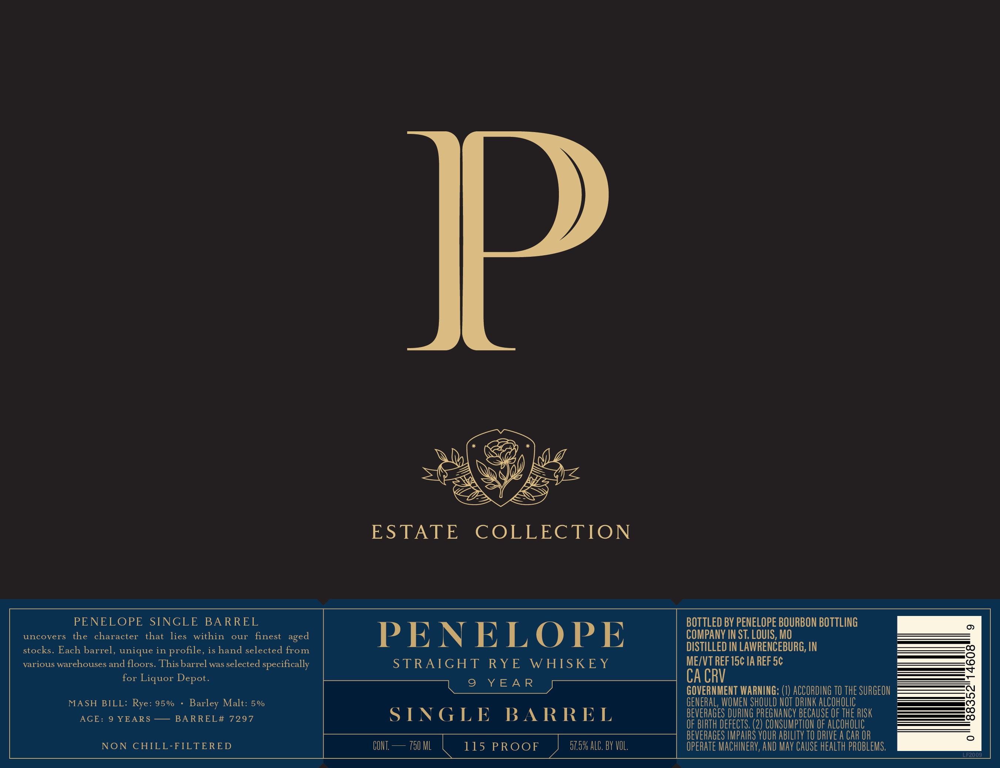
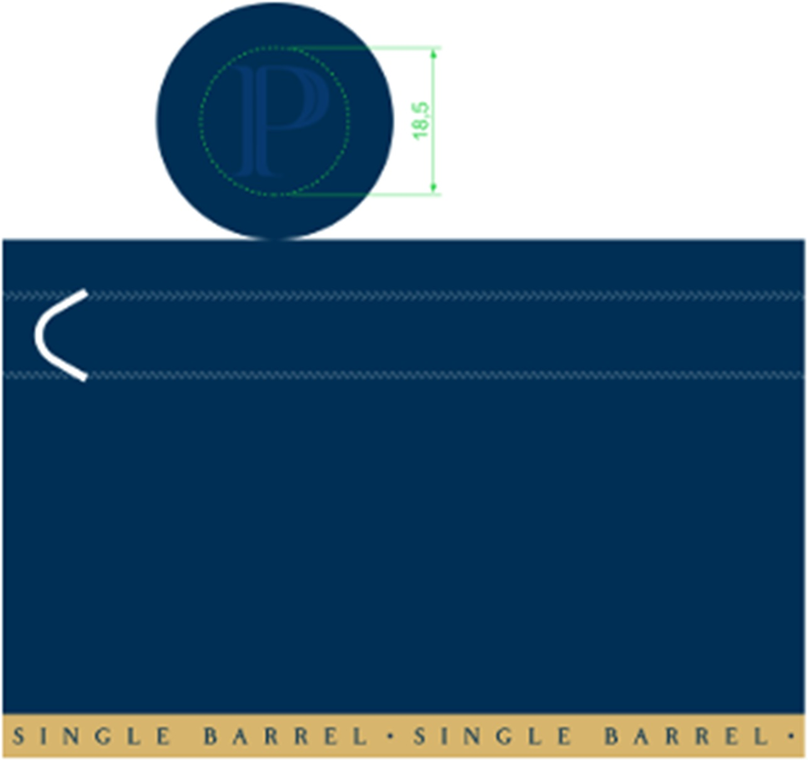

# TTB COLA Label Images - TTBID 26201001000055

**Brand Name:** PENELOPE

**Issue Date:** 07/22/2026

**Origin Code:** 29

**Product Class/Type:** 102

**Source:** [TTB Public COLA Registry](https://ttbonline.gov/colasonline/viewColaDetails.do?action=publicFormDisplay&ttbid=26201001000055)

## Label Images

### Label 1

### Label 2

## Extracted Label Text

*Text extracted via OCR - may contain errors*

*1 image(s) excluded: text did not meet readability threshold*

**Detected Proof:** 115
**Detected Age:** 9 Years

### Label 1

Jl
ESTATE
COLLECTION
PENELOPE SINGLE
BA RREL
BOTTLED BY PENELOPE BOURBON BOTTLING
uncovers
the character
that
lies
within
our
finest
PENELOPE
COMPANY IN ST: LOUIS, MO
stocks. Each barrel, unique in profile, is hand selected from
DISTILLED IN LAWRENCEBURG, IN
various warehouses and floors. This barrel was selected specifically
STRAIGHT
RYE
W HISKE Y
MEZVT REF 15c IA REF5c
8
for Liquor Depot.
9
Y EA R
CA CRV
GOVERNMENT WARNING: (1) ACCORDING TO THE SURGEON
MASH BILL: Rye: 95%
Malt: 5%
GENERAL; WOMEN SHOULD NOT DRINK alCOhOLIc
3
AGE:
9 YEARS
BA RREL# 7297
S INGLE
BA RRE L
BEVERAGES DURING PREGNANCY BECAUSE OF ThE RISK
OF BIRTH DEfECTS; (2) CONSUMPTLON OF AlCOhOlic
BEVERAGES IMPAIRS VOUR AbILITy TO DRIVE A CAR OR
NON
CHILL-FILTERED
CONT
750 ML
115 PROOF
57.5% ALC. BY VOL.
operate MACHINERV, AND Mav CauSe health pRObLeMS;
F200g
TU)
aged
Barley
