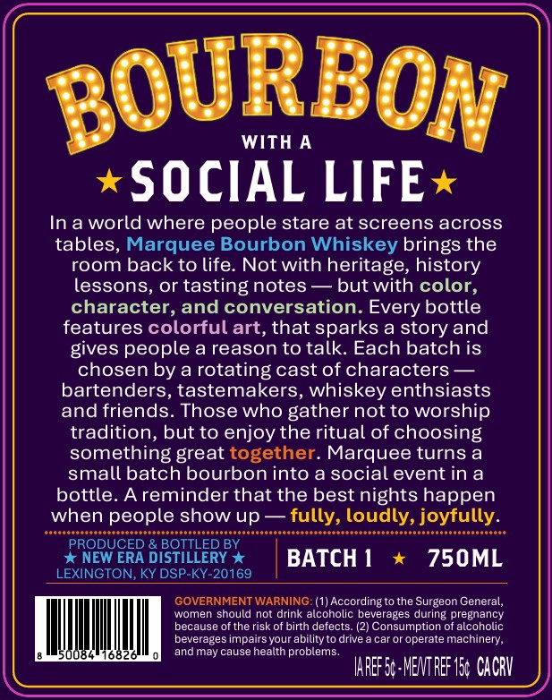
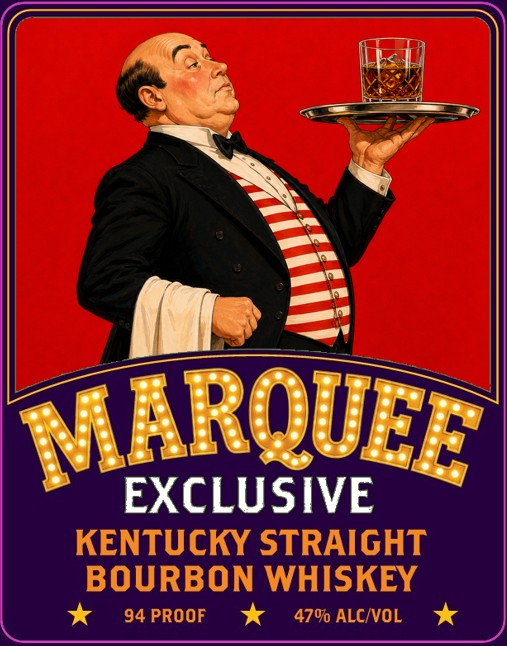

# TTB COLA Label Images - TTBID 26201001000140

**Brand Name:** MARQUEE EXCLUSIVE

**Issue Date:** 08/03/2026

**Origin Code:** 22

**Product Class/Type:** 101

**Source:** [TTB Public COLA Registry](https://ttbonline.gov/colasonline/viewColaDetails.do?action=publicFormDisplay&ttbid=26201001000140)

## Label Images

### Back Label

### Label 1

## Extracted Label Text

*Text extracted via OCR - may contain errors*

**Detected Proof:** 94

### Back Label

BOURBON
WITH A
SOCIAL LIFE
In a world where people stare at screens across
tables, Marquee Bourbon Whiskey brings the
room back to life
Not with heritage, history
lessons, or tastingnotes
but with color,
character, and conversation. Every bottle
features colorful art, that sparks a story and
gives people a reason to talk
Each batch is
chosen by a rotating cast of characters
bartenders, tastemakers, whiskey enthsiasts
and friends
Those who gather not to worship
tradition, but to enjoy the ritual of choosing
something great together. Marquee turns a
small batch bourbon into a social event in a
bottle_
Areminder that the best nights happen
when people show up
fully, loudly, joyfully
PRODUCED & BOTTLED BY
NEW ERA DISTILLERY
BATCH 1
750ML
LEXINGTON, KY DSP-KY-20169
GOVERNMENT WARNING: (1) According to the Surgeon General,
women should not drink alcoholic beverages during pregnancy
because
the risk of birth defects: (2) Consumption of alcoholic
beverages impairs your ability to drive
car or operate machinery,
008
andmay cause
problems
IAREF S: MENT REF I5 CaCrV
health E

### Label 1

MRQUEE
EXCLUSIVE
KENTUCKY STRAIGHT
BOURBON WHISKEY
94 PROOF
470 ALCIVOL
