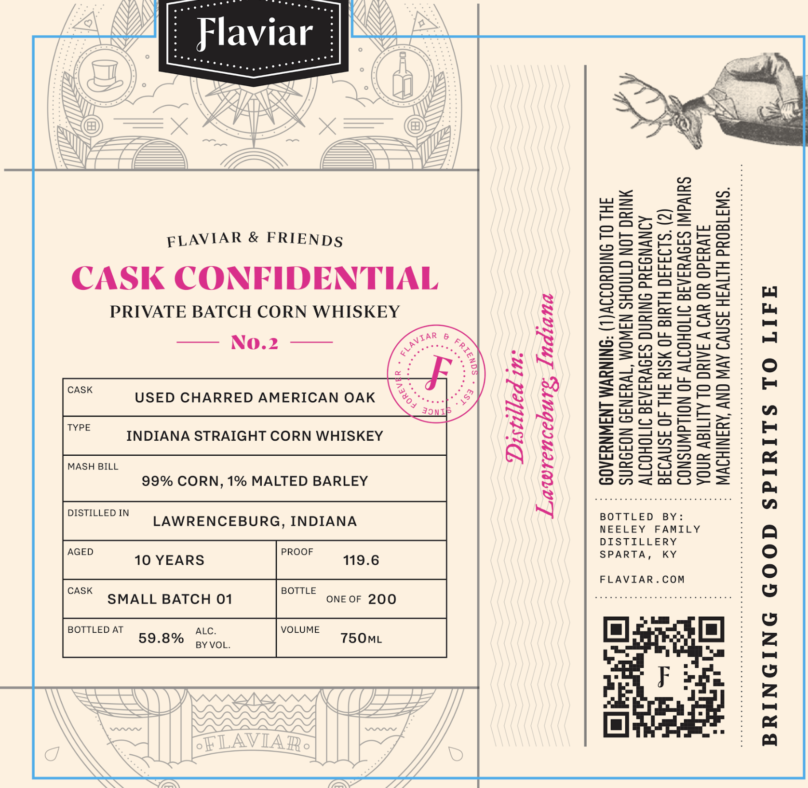

# TTB COLA Label Images - TTBID 26201001000146

**Brand Name:** FLAVIAR

**Issue Date:** 07/22/2026

**Origin Code:** 22

**Product Class/Type:** 103

**Source:** [TTB Public COLA Registry](https://ttbonline.gov/colasonline/viewColaDetails.do?action=publicFormDisplay&ttbid=26201001000146)

## Label Images

### Label 1

## Extracted Label Text

*Text extracted via OCR - may contain errors*

**Detected Proof:** 119.6
**Detected Age:** 10 Years

### Label 1

| Flaviar :

ELAVIAR & FRIENDS

CASK CONFIDENTIAL

PRIVATE BATCH CORN WHISKEY

USED CHARRED AMERICAN OAK

INDIANA STRAIGHT CORN WHISKEY

Distilled in

MASH BILL

CONSUMPTION OF ALCOHOLIC BEVERAGES IMPAIRS

YOUR ABILITY TO DRIVE A CAR OR OPERATE
MACHINERY, AND MAY CAUSE HEALTH PROBLEMS.

SURGEON GENERAL, WOMEN SHOULD NOT DRINK

ALCOHOLIC BEVERAGES DURING PREGNANCY
BECAUSE OF THE RISK OF BIRTH DEFECTS. (2)

uu
==
=
i=)
=
o
=
a
[a=
f=}
oO
ao
=
=
(7)
* =
=
=
=
=
=
Lo
=
=
co
ui
=>
[—]
o

99% CORN, 1% MALTED BARLEY

DISTILLED IN LAWRENCEBURG, INDIANA

AGED 10 YEARS PROOF 119.6 SPARTA, KY
FLAVIAR.COM

CASK BOTTLE

0 fe)

BRINGING GOOD SPIRITS TO LIFE
