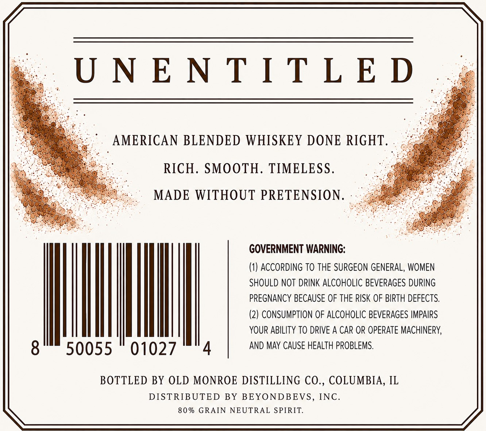
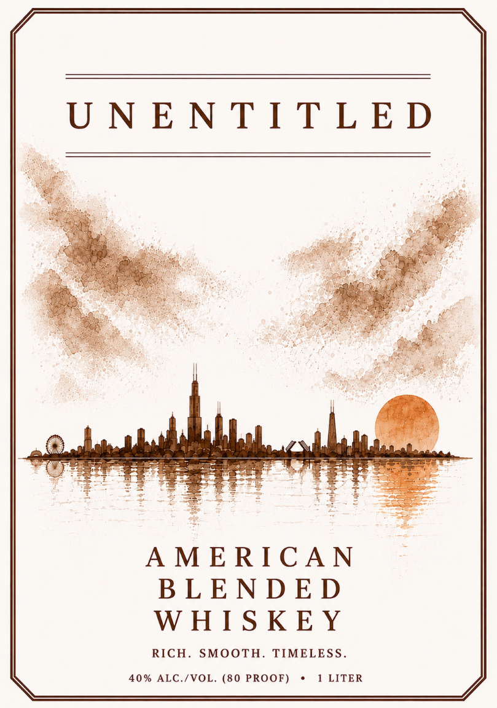

# TTB COLA Label Images - TTBID 26201001000205

**Brand Name:** UNENTITLED

**Issue Date:** 08/14/2026

**Origin Code:** 04

**Product Class/Type:** 137

**Source:** [TTB Public COLA Registry](https://ttbonline.gov/colasonline/viewColaDetails.do?action=publicFormDisplay&ttbid=26201001000205)

## Label Images

### Back Label

### Front Label

## Extracted Label Text

*Text extracted via OCR - may contain errors*

*1 image(s) excluded: text did not meet readability threshold*

### Back Label

UNENTITLED

AMERICAN BLENDED WHISKEY DONE RIGHT

RICH. SMOOTH. TIMELESS

MADE WITHOUT PRETENSION

GOVERNMENT WARNING:

(1) ACCORDING TO THE SURGEON GENERAL, WOMEN

SHOULD NOT DRINK ALCOHOLIC BEVERAGES DURING

PREGNANCY BECAUSE OF THE RISK OF BIRTH DEFECTS

(2) CONSUMPTION OF ALCOHOLIC BEVERAGES IMPAIRS

YOUR ABILITY TO DRIVE A CAR OR OPERATE MACHINERY,

|

mM)

50055 — 01027

AND MAY CAUSE HEALTH PROBLEMS.

BOTTLED BY OLD MONROE DISTILLING CO., COLUMBIA, IL

DISTRIBUTED BY BEYONDBEVS, INC

80% GRAIN NEUTRAL SPIRIT.
