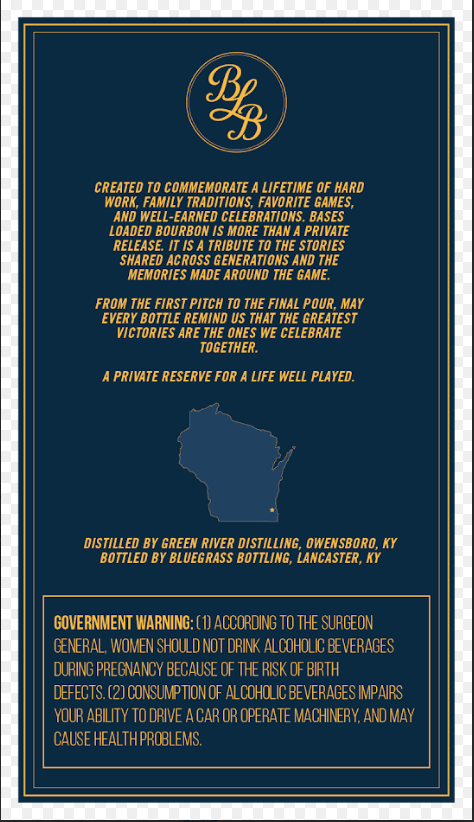
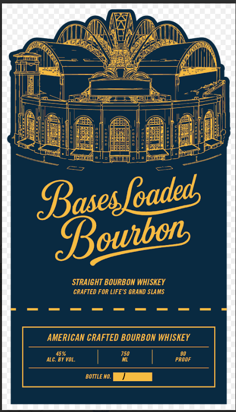

# TTB COLA Label Images - TTBID 26201001000214

**Brand Name:** BASES LOADED

**Issue Date:** 07/22/2026

**Origin Code:** 22

**Product Class/Type:** 101

**Source:** [TTB Public COLA Registry](https://ttbonline.gov/colasonline/viewColaDetails.do?action=publicFormDisplay&ttbid=26201001000214)

## Label Images

### Back Label

### Front Label

## Extracted Label Text

*Text extracted via OCR - may contain errors*

**Detected Proof:** 90

### Back Label

CREATED TO COMMEMORATE A LIFETIME OF HARD
WORK, FAMILY TRADITIONS, FAVORITE GAMES,
AND WELL-EARNED CELEBRATIONS. BASES:
LOADED BOURBON 1S MORE THAN A PRIVATE
RELEASE. IT IS A TRIBUTE TO THE STORIES
SHARED ACROSS GENERATIONS AND THE
MEMORIES MADE AROUND THE GAME.
FROM THE FIRST PITCH TO THE FINAL POUR, MAY
EVERY BOTTLE REMIND US THAT THE GREATEST
VICTORIES ARE THE ONES WE CELEBRATE
TOGETHER.
A PRIVATE RESERVE FOR A LIFE WELL PLAYED.
DISTILLED BY GREEN RIVER DISTILLING, OWENSBORO, KY
BOTTLED BY BLUEGRASS BOTTLING, LANCASTER, KY
GOVERNMENT WARNING: (1D ACCORDIN TO THE SURGEON
GENERAL WOMEN SHOULD NOT DRINK ALCOHOL BEVERAGES
DURINS PREGNANCY BECAUSE OF THE SK OF BRTH
DEFECTS (2) CONSUNPTIONOF ALCOHOLIC BEVERAGES INPARS
YOUR ABLITY TODRIVE A GAR OR OPERATE MACHINERY, AND MAY
CAUSE HEALTH PROBLEMS

### Front Label

Basesfoaded
Bownbon
STRAIGHT BOURBON WHISKEY
CRAFTED FOR LIFE'$ GRAND SLAMS
AMERICAN CRAFTED BOURBON WHISKEY
45%
ALC. BY VOL.
PROOF
BOTTLE NO.
