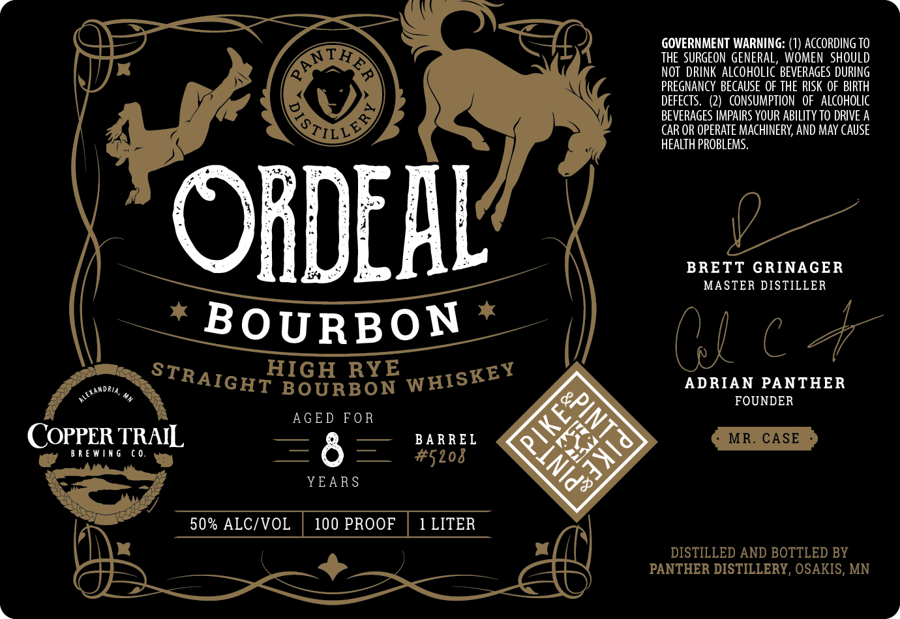

# TTB COLA Label Images - TTBID 26201001000267

**Brand Name:** PANTHER DISTILLERY

**Fanciful Name:** ORDEAL HIGH RYE STRAIGHT BOURBON WHISKEY

**Issue Date:** 07/23/2026

**Origin Code:** 27

**Product Class/Type:** 101

**Source:** [TTB Public COLA Registry](https://ttbonline.gov/colasonline/viewColaDetails.do?action=publicFormDisplay&ttbid=26201001000267)

## Label Images

### Label 1

## Extracted Label Text

*Text extracted via OCR - may contain errors*

**Detected Proof:** 100

### Label 1

GOVERNMENT WARNING: (1) ACCORDING TO
THE  SURGEON GENERAL
WOMEN   SHOULD
AnEA
NOT  DRINK ALcohOLIc BEVERAGES DURING
PREGNANCY BECAUSE OF THE RISK OF BIRTH
DEFECTS.
CONSUMPTION  OF   aLcohoLic
BEVERAGES IMPAIRS YOUR ABILITy TO DRIVE A
CAR OR OPERATE MACHINERY; AND MAY CAUSE
hEALTH PROBLEMS.
ORDEHL
BRETT GRINAGER
MASTER DISTILLER
BOURBON
Q
HIGH RYE
DRIA,
BOURBON
ADRIAN PANTHER
FOUNDER
AGE D FO R
COPPER TRAIL
BA RREL
MR_
CASE
B R E Win g
( 0.
=&
#5208
YEA R S
50% ALC/VOL
100 PROOF
1 LITER
DISTILLED AND BOTTLED BY
PANTHER DISTILLERY, OSAKIS, MN
QuLlD)
WHISKEY
STRAIGHT
MXamc
[&PINT
p
E
JXId"
