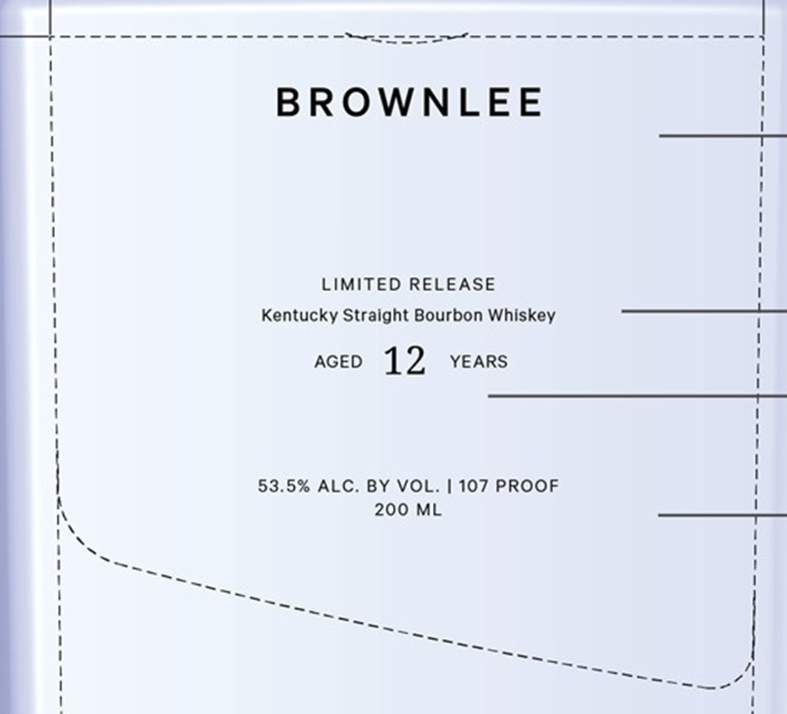

# TTB COLA Label Images - TTBID 26201001000320

**Brand Name:** BROWNLEE

**Issue Date:** 07/23/2026

**Origin Code:** 22

**Product Class/Type:** 101

**Source:** [TTB Public COLA Registry](https://ttbonline.gov/colasonline/viewColaDetails.do?action=publicFormDisplay&ttbid=26201001000320)

## Label Images

### Back Label

### Label 1

## Extracted Label Text

*Text extracted via OCR - may contain errors*

*1 image(s) excluded: text did not meet readability threshold*

**Detected Proof:** 107
**Detected Age:** 12 Years

### Label 1

pt tenet et

a et eet ted ee eet et eet ented ett

ers Or

SSS

BROWNLEE

LIMITED RELEASE

Kentucky Straight Bourbon Whiskey

AGED 12 years

53.5% ALC. BY VOL. | 107 PROOF

200 ML

1S

1s

-—

SSK

SS

4

a eee s
