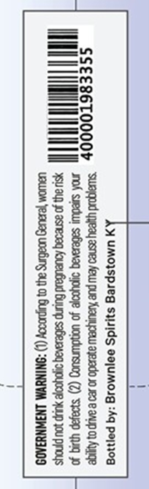
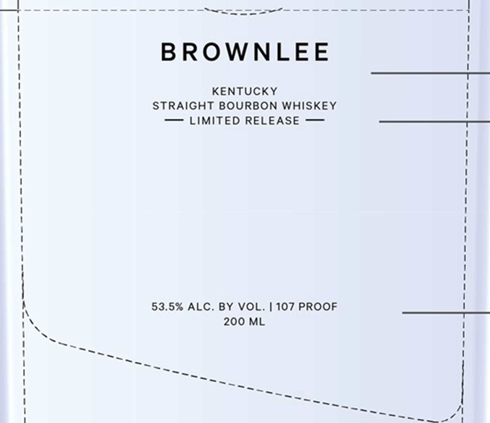

# TTB COLA Label Images - TTBID 26201001000324

**Brand Name:** BROWNLEE

**Issue Date:** 07/22/2026

**Origin Code:** 22

**Product Class/Type:** 101

**Source:** [TTB Public COLA Registry](https://ttbonline.gov/colasonline/viewColaDetails.do?action=publicFormDisplay&ttbid=26201001000324)

## Label Images

### Back Label

### Label 1

## Extracted Label Text

*Text extracted via OCR - may contain errors*

*1 image(s) excluded: text did not meet readability threshold*

**Detected Proof:** 107

### Label 1

BROWNLEE
KEnTUCKY
STRAiGHT BOURBON Whiskey
Limited RELEASE
53.5% ALC
BY VOL.| 107 PROOF
200 ML
