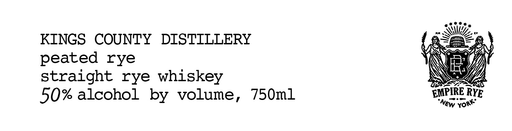
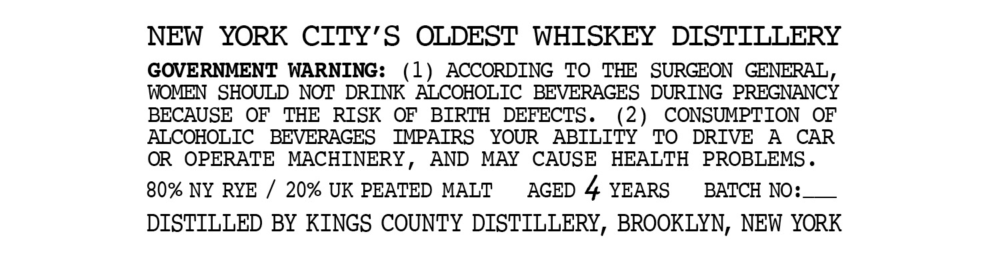

# TTB COLA Label Images - TTBID 26201001000344

**Brand Name:** KINGS COUNTY DISTILLERY

**Issue Date:** 07/22/2026

**Origin Code:** 02

**Product Class/Type:** 102

**Source:** [TTB Public COLA Registry](https://ttbonline.gov/colasonline/viewColaDetails.do?action=publicFormDisplay&ttbid=26201001000344)

## Label Images

### Front Label

### Label 2

## Extracted Label Text

*Text extracted via OCR - may contain errors*

**Detected Proof:** 100
**Detected Age:** 4 Years

### Front Label

KINGS COUNTY DISTILLERY TaN
peated rye NV)
straight rye whiskey NEY
50% alcohol by volume, 750ml EINPIRE RYE
you

### Label 2

NEW
YORK CITY'S
OLDEST WHISKEY
DISTTLLERY
GOVERNMENT WARNING:
(1)
ACCORDING
TO
TH
SURGEON  GENERAL,
WOMEN SHOULD NOT DRTNK ALCOHOLIC BEVERAGES DURING PREGNANCY
BECAUSE
OF
THE
RISK
OF
BIRTH
DEFECTS .
(2)
CONSUMPTION
OF
ALCOHOLIC
BEVERAGES
IMPATRS
YOUR
ABILITY
TO
DRIVE
A
CAR
OR
OPERATE
MACHINERY,
AND
MAY
CAUSE
HEALTH
PROBLEMS _
80% NY RYE
20% UK PEATED MALT
AGED 4 YEARS
BATCH NO=
DISTILLED BY KINGS COUNTY DISTILLERY, BROOKLYN, NEW YORK
