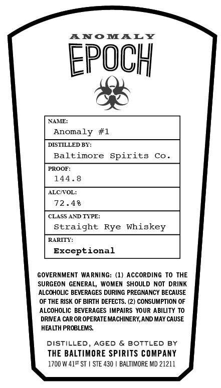
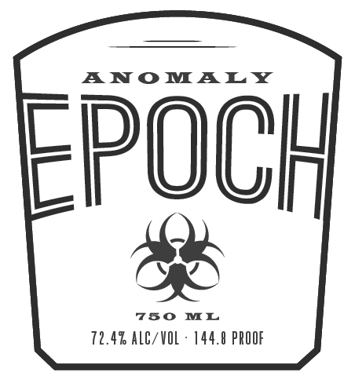

# TTB COLA Label Images - TTBID 26201001000385

**Brand Name:** EPOCH

**Issue Date:** 07/23/2026

**Origin Code:** 25

**Product Class/Type:** 102

**Source:** [TTB Public COLA Registry](https://ttbonline.gov/colasonline/viewColaDetails.do?action=publicFormDisplay&ttbid=26201001000385)

## Label Images

### Back Label

### Front Label

### Label 3

## Extracted Label Text

*Text extracted via OCR - may contain errors*

*2 image(s) excluded: text did not meet readability threshold*

**Detected Proof:** 144

### Back Label

ANOmALY
EpOCH
NAME:
Anomaly
#1
DISTILLED BT:
Baltimore
Spirits
Co
PROOF:
144 .8
ALCOL:
72 .48
CLASS AND TIPE:
Straight
Rye
Whi
RARITT:
Exceptional
GOVERNMENT
WARNING: (1) ACCORDING To
THE
SURGEON GENERAL_
WOMEN
SHOULD NOT DRINK
ALCOHOLIC BEVERAGES DURING PREGNANCY BECAUSE
OF THE RISK OF BIRTH DEFECTS. (2) CONSUMPTION OF
ALCOHOLIC BEVERAGES IMPAIRS YOUR ABILITY TO
DRIEA CAR OR OPERATE MACHINERY,AND MAY CAUSE
HEALTH PROBLEMS
DISTILLED, AGED
& BOTTLED
BY
THE BALTIMORE SPIRITS COMPANY
1700 W 41St ST | STE 430
BALTIMORE MD 21211
skey
