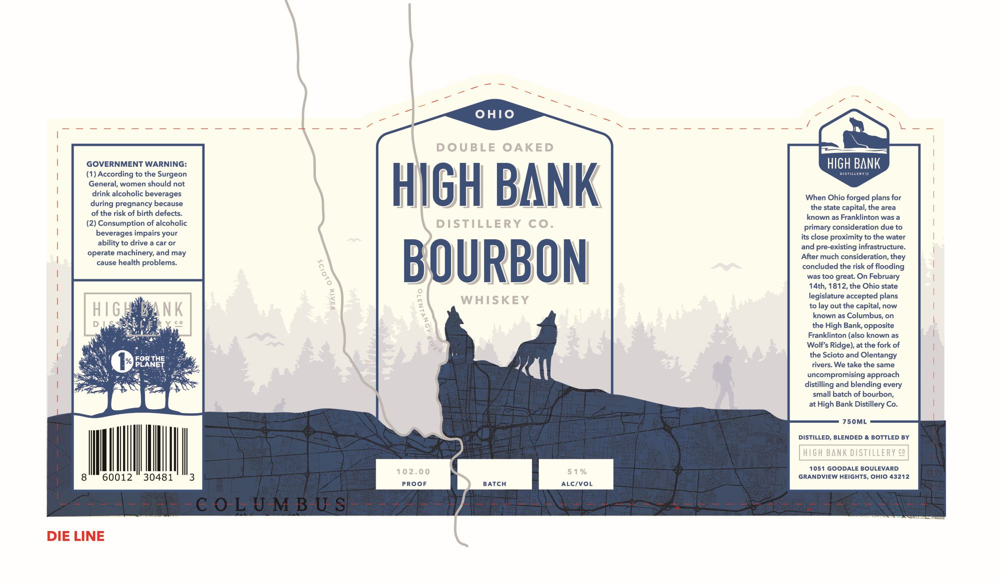

# TTB COLA Label Images - TTBID 26201001000417

**Brand Name:** HIGH BANK DISTILLERY CO.

**Fanciful Name:** DOUBLE OAKED

**Issue Date:** 07/24/2026

**Origin Code:** 09

**Product Class/Type:** 141

**Source:** [TTB Public COLA Registry](https://ttbonline.gov/colasonline/viewColaDetails.do?action=publicFormDisplay&ttbid=26201001000417)

## Label Images

### Label 1

## Extracted Label Text

*Text extracted via OCR - may contain errors*

### Label 1

OhIO
DOUBLE
OAKED
GOVERNMENT WARNING:
HIGH BANK
(1) According to the Surgeon
mnaet1
Geirkalcobolet baeragest
HIGH BANK
When Ohio forged plans for
during pregnancy because
the state capital, the area
of the risk of birth defects:
known as Franklinton was
(2) Consumption of alcoholic
DISTILLERY
Co
primary consideration due to
beverages impairs your
its close proximity to the water
ability to drive
car or
and pre-existing infrastructure:
operate machinery, and may
After much consideration; they
cause health problems:
BOURBON
concluded the risk of
'flooding
was too
On February
14th; 1812,the Ohio state
WHISKEY
legislature accepted plans
hIGH
NK
7
to lay out the capital, now
known as Columbus; on
the
 High Bank, opposite
Franklinton (also known as
Wolf's Ridge); at the fork of
the Scioto and Olentangy
[FoRNET
rivers. We take the same
uncompromising approach
distilling and blending every
small batch of bourbon
at High Bank Distillery Co_
750ML
DISTILLED, BLENDED & BOTTLED BY
high BAnk DISTILLERY C
1051 GOODALE BOULEVARD
10 2.0 0
5 1 %
60012
30481
GRANDVIEW HEIGHTS, OHIO 43212
PROOF
BATCH
ALc/vol
€C OL U M B U Sl
DIE LINE
1
great
